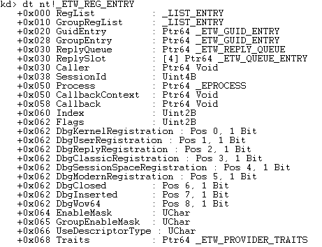
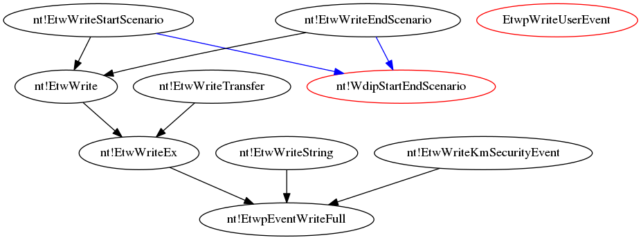
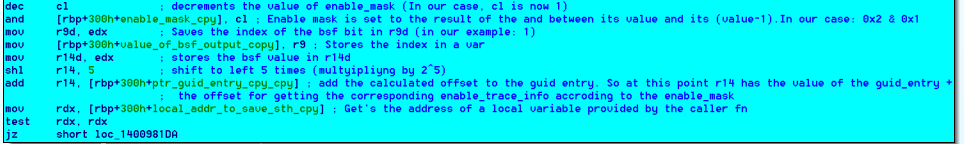
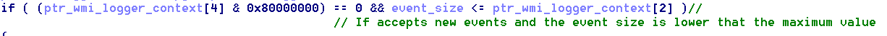
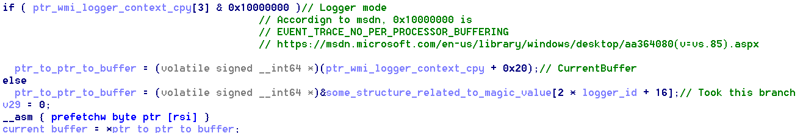
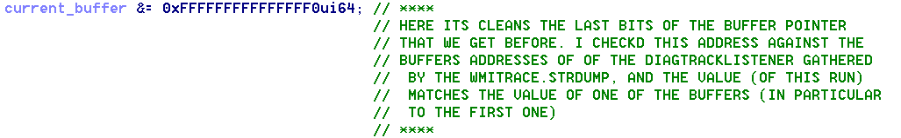
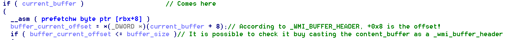
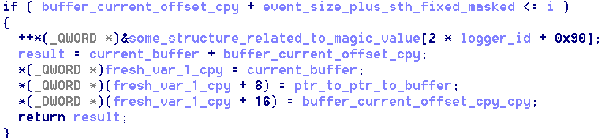
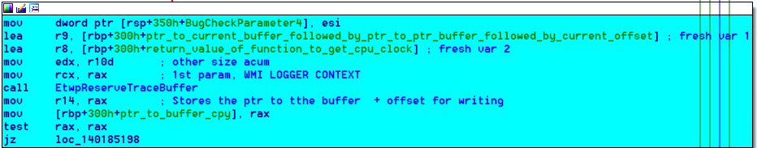
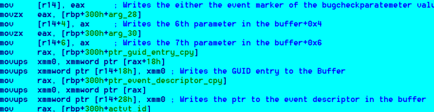

# First milestone: Trace Telemetry providers

## Crossing GUIDS between register and write

### Strategy

So our first goal is to try to detect when a Telemetry provider is trying to write, in order to print the call stack and see where this code is running.

Due to the **EtwWrite** function uses the handler provider by the **EtwRegister** we need first to set a breakpoint on it in order to later on cross check which guids have written.

Steps:

* Open a windbg kernel session
* set initial breakpoint
* load script
* open log
* run script
* On the target, get the providers related with the Diagtrack listener session (command in telemetry page )
* Pause the execution of the target
* save the output
* save the output (log) of the windbg script
* Execute python output parsers
* Compare results

### Results

On **Security** level I have only 3 Guids (in fact is only 1 an after a couple of minutes running two more get registered) and none of them are being shown by the script developed.

On **Basic** level I have 318. 61 registered.

On **Enhanced**

On **Full**

### Disclaimer

From now on, all the test were made with the **BASIC** level of Telemetry.

### Extracting handler from EtwRegister (how I found it)

Steps:

* Set 3 breakpoints:

    * At **nt!EtwRegister**
    * At **nt!EtwRegister+0x38** (last instruction)
    * At **nt!EtwEventEnabled** function called by **EtwRegisterEx** which need the handler as first parameter.
* Once I found the value that the **EtwEventEnabled** was receiving, I move forward to the 3rd breakpoint and try to look at that value. It wasn't present in the registers so I looked at the stack and found it in rsp+0x90. But..we still need to Understand why exactly in that offset. And, also.. How can we be really sure that that guy is the handler?

Some time later I realize that **nt!EtwRegister** wasn't the only way of registering a provider. It also exists another called **nt!EtwRegisterClassicProvider**. The most important fact was that both were doing like a "parameter arrangement" and then calling a third function.. **EtwpRegisterProvider**. This last function was the one that had all the real logic implementation.


In order to fully understand what was happening, why the offset was 0x90, if the handler was really the handler, I had to RE the functions involved in the registration process. The whole explaining it, is here:

[reversing etw register process](./internal_docs/reversing_etwpregisterProvider.odt)

Besides all the study, the pretty good outcomes where that I successfully reverse two different Kernel structures (not the whole of them but the important part). The "bad" thing later was that I found the symbols of them, so they were already "documented?".

### Kernel structures for GUID and Handler (and also the status of the whole ETW system)

The outcome of the reversing part was very good. I was able to understand two involved structures and later on discover there full layout:

#### \_ETW_GUID_ENTRY


#### \_ETW_REG_ENTRY



This allowed us to only focus on the **EtwWrite** part.

### Catching the Telemetry provider only with EtwWrite

Thanks to the knowledge we have on how the handler works, we are able to only set a breakpoint in the EtwWrite.
But very soon we encountered some issues:

* Which function should we use? There are a lot of type for Writing



* We can't make a script to ask if the current handler's GUID is one of the ~350 providers of the Telemetry (in certain level) because the answer won't return.

I started to think if there is any possibility of linking the GUID and the HANDLER with some SILOGLOBALS and try to detect if the provider that is writing right now is linked with the logger/session of the DiagTrack.  After some time I find some very interesting function names (maybe for further analysis) but for now they didn't help me at all. Basically the entire **etwp\*** family seems to be very useful .

After some time I decide to do something manual to see if we can extract from the process something to automate. I started using a very simple script:

```windbg
bp nt!EtwWrite ".printf \"Handler: %N\\n\",@rcx"
```

Just, printing the handler each time an EtwWrite call was performed. Once I had the handler I get the GUID manually and then cross reference it with the output of the powershell command get-etw-providers (this time, without any filter, just ALL the providers of ETW).

This showed me that, most of the time, the same provider was writing. It was the following:

Key             | Value
---             | ---
SessionName     | EMPTY
AutologgerName  | DefenderApiLogger
Guid            | {E02A841C-75A3-4FA7-AFC8-AE09CF9B7F23)
Level           | 31
MatchAnyKeyword | 0x
MatchAllKeyword | 0x
Property        | EMPTY

Due to for the sake of our test it wasn't interesting, I excluded it with:

```windbg
bp nt!EtwWrite ".if (@rcx != ffffda839f0c2c50){.printf \"Handler: %N\\n\",@rcx;gc;}.else{gc;} "
```

**ffffda839f0c2c50** was the memory address of the handler.
After doing this there were just a few writings more showed up in the screen. But still there were not of our interest.

Then I decided to change, to do the same, but this time in **EtwWriteTransfer**:

```windbg
bp nt!EtwWriteTransfer ".if (@rcx != ffffda839f0c2c50){.printf \"Handler: %N\\n\",@rcx;gc;}.else{gc;} "
```

Some new handlers started to appear. After ensuring to with GUID they were related, I finally find that there was one of related to the Diagtrack:
Key             | Value
---             | ---
SessionName     | Diagtrack-Listener
AutologgerName  | EMPTY
Guid            | {E9EAF418-0C07-464C-AD14-A7F353349A00}
Level           | 255
MatchAnyKeyword | 0x800000000000
MatchAllKeyword | 0x0
Property        | 929

Once I was sure about this, I modified again the script to just listen for writes of this handler and if that happened, print the stack trace:

```windbg
bp nt!EtwWriteTransfer ".if (@rcx == FFFFDA83A036F0D0){.printf \"Handler: %N\\n\",@rcx;kc;gc;}.else{gc;} "
```

So it was manually, yes, but at least, we have our first stack trace. We still need to learn how to automate this (without taking so much time like the 360-ifs-script)

```windbg
 Call Site
00 nt!EtwWriteTransfer
01 nt!TlgWrite
02 nt!CmpInitHiveFromFile
03 nt!CmpCmdHiveOpen
04 nt!CmLoadAppKey
05 nt!CmLoadDifferencingKey
06 nt!NtLoadKeyEx
07 nt!KiSystemServiceCopyEnd
08 ntdll!NtLoadKeyEx
09 0x0
```

## Automatic detection of providers using just Write

### Still trying to automate (new idea?)

The effort of automating this continues. One strategy (I don't shared it too much) is to dump everything and afterwards do an post-analysis of the log. I've my python framework to do it, but still, I didn't find it very nice. Either way, I've set 2 breakpoints (**nt!EtwRegister** and **nt!EtwWrite**) and I'm printing the handler and the GUID in the former, and the handler together with the KC in the later. The later breakpoint is only enabled once the system has already booted. The idea is to, afterwards, use the handler as the "BRIDGE" between these two pieces of information, and use the GUID to cross check it with the ones related with the telemetry.
Anyways, this has a big problem. The GUID's that we know are linked to the telemetry, are gathered once the powershell script is executed, so it's totally arbitrary.
With this approach, if a provider manage to make a registration, write and then perform an unregistration, if we didn't issue the powershell command in the middle we are going to think that the provider is not important for us, while this is completely False.

I proposed a new idea. What if we can relate the handler that is writing, with the session that is going to write, somehow. If we can do that, then, we will just need to set a breakpoint at **nt!EtwWriteEx** (or some of them) and understand if the current provider is linked with the Diagtrack session. Anyways some questions comes to my mind:

* A provider can provide events to more than 1 session. How can we really be sure that the event that is writing is related with the session we want?
* We already know that the handlers are shared (I've seen EtwWrites performed with the same handlers but with different call stacks)

There is a structure called **WMI_LOGGER_CONTEXT** which is the representation of a session. Inside it there is a field called **ProvidersbinaryList**. We don't know yet what exactly this structure has but it could possibility help us to create a link between the logger/session and the provider.

Anyways, if we are able to do the link FROM the provider (using the handler) will be much better, due to it won't be necessary to iterate the whole double linked binary list.

### Reversing session and provider relationship

The last idea mentioned above, seems to be the best option. It will allow us to be sure if the provider is one of our interest or not.
I started doing some RE from the **nt!EtwWriteEx** in order to see if the **nt!\_ETW_REG_ENTRY** structure has something that can helped us. Unfortunately, I didn't find anything useful so far.

As we mentioned, **WMI_LOGGER_CONTEXT** has a field which seems to group all the providers linked with the session, in a double linked list. I couldn't get the link just seeing at the list, so I decided to do some RE in how the providers are attached to sessions.

I find that there is a functionality called **nt!EtwpAddProviderToSession** which seems to be the one that is doing the link. It is very deep in the call stack (**nt!EtwpRegisterProvider --> nt!EtwpProviderActiveCallback --> nt!EtwpAddProviderToSession** ). It's being also a little difficult to follow it due to it's using some functionalities which documentation is not available ( like **RtlGetImageSize** and so on). Furthermore, seems that they are dealing with binaries format **(Don't know why yet)**,

I was doing some reversing here while I found realize some interesting... So the full reverse of this will be continued

### Using Enable Trace info

There is a structure called **nt!\_ENABLE_TRACE_INFO**, which holds information about the relation ship between a provider and the session (BINGO!). Inside the handler structure, we found one (seems to be special) of this guys and afterwards an array of 8 of them. Doing some empiric (TODO: Find this in the code) tests, I realize that if a provider is enabled for a session, then the "special" one will have the **activated** field in 1, but nothing in the **loggerid** field. Seems that this "special" is only for telling that the provider is enabled, but if you want more information about it you should go to each bucket of the array. Experience tell that if the "special" has the field **activated** in 1, there must be at least one bucket in the array with information about a session. There, you'll find, in the **loggerid** field, so this is our link to the session!.

I've developed a script that, once it ensures that the provider is active for some session (asking this to the "special") then it iterates the array to search for the session of telemetry. Anyways, I still have some questions to solve:

* How to get the **loggerid** of the Diagtrack Session in runtime (I almost sure it can change, right now is hardcoded in the script)
* Again, based on empiric tests, I'm almost sure that if the provider is activated for 3 different sessions, then only the first 3 buckets of the **nt!\_ENABLE_TRACE_INFO** array will be filled. So, the while structure that is inside the script is considering this as breaking once we found a bucket that is not activated. (**Is it really like that?**).
* What about the flags of the provider? Each link between a session and a provider has its own **keywords** ? How can be really sure that the event that is going to be logged is really going to be logged and is not going to filtered afterwards by the flags of the session? Read, at least, providers paragraph from [document](https://blog.mozilla.org/sfink/2010/11/02/etw-part-3-architecture/)

### A stumble is not a fall

After finishing developing the script, I tested against the **loggerid 0x21**, but the breakpoint was never reached. I was really dizzy, because according to the logic it should work. I spent an entire day trying to figure it out what was happening. Finally, after reversing the behavior of **nt!EtwWriteEx** and **nt!EtwpEventWriteFull** I confirmed that my logic was OK. In some part of the latter, (identified in the ida db) it starts "iterating" each **nt!\_ENABLE_TRACE_INFO** bucket of the structure, getting the **loggerid** and doing some comparison using masks.

The key thing I didn't realize is that I was just paying attention to the **EnableInfo** (the array) of the  **Guid entry** pointed by the handler, but not paying any attention to the **Group Entry**. The handler structure (shown some sections above) has two different entries (offsets: 0x20 and 0x28) which are of type **nt!\_ETW_GUID_ENTRY**. Although, I should continue looking to better understand the meaning of the group entry and how a group if build, at least, I can be sure that there is our answer. How can I be sure? I put a breakpoint in "nt!EtwWriteEx" with a GUID of a known telemetry provider, and once it jumped I started analyzing there structure. Although, the GUID entry wasn't enabled for anyone, the group entry was, and in fact was enable for the 0x21 which is our logger =D.

### The phoenix rises from the ashes

Finally, I was able to solve the issue. My following step was to create 2 different scripts. The first one is going to detect the logger id automatically for the "Diagtrack-Listener" once the session it started. Once we have the logger id linked to the Telemetry session, we are going to store it in a particular register and then set a breakpoint in **nt!EtwWrite** function, which will hold the second script. The latter, is a script which will analyze both, the Entry Guid and the Group Entry of the handler provided by parameter. In each of them, will iterate the **EnableInfo** list looking for providers that are activated and also linked to the **logger id** that we just recovered from the previous script. If all this conditions are accomplished, the call stack will be printed out.

### Real Telemetry providers ?

One of the questions that came to my mind while I was doing this was: Ok, we have the link to the session... but is there other way of confirming that these providers are really connected with the Telemetry?.
Then, I remember the previous strategies that I tried to followed and remembered that old dirty Powershell script that will give you back information about each provider related with that session. This must help.

I was printing each time I captured an ETW Write related with the telemetry, either the GUID or the Group Guid. Doing some post-analysis I realise that the GUID was always the same, which seemed (at least to me) something strange. Even worst, when I tried to look it up in the telemetry related providers (according to the output of the EtwProvider) I couldn't find it.

Maybe it was obvious, but for me it wasn't. After taking two minutes to think was possible could happened, I got some idea. Most of the time, the GUID that was being printed came from the part of the script where the GROUP Entry was the one involved, and not the GUID entry itself. So, the GUID that the script was printing, wasn't the one related with the provider but the one related to the Group of providers. Some time later I understood that even though the provider itself is not activated to log in that session, because it is registered in a group that it is, then it will log the events anyways. This took me to add a line to the script: When printing the group GUID, print also the **Provider Guid**.

After doing this, I was able to confirm that the providers that were writing because they were registered in a Group who was related with this session, were the ones related with the Telemetry by doing a cross check with the output of the Powershell script.

### Are we breaking in the correct place ?

Once thing that was triggered in certain moment was.. Are we really breaking in the correct place?. I was looking and trying to understand how  the **level**  and **keywords** affect the "writeness" of the events. Here is some [documentation](https://docs.microsoft.com/en-us/message-analyzer/system-etw-provider-event-keyword-level-ettings#BKMK_FindingKeywords) that helped me a lot understanding how this works. The thing is that if the **level** and **keywords** of the event that wants to be written (**EVENT_DESCRIPTOR**) "don't match" the ones specified by the provider, the event won't be written at all. Right now, we're setting the breakpoint when the **nt!EtwWriteEx** is called, but... the filtering is carried out afterwards :


That picture illustrates a basic block inside the **nt!EtwWriteEx** function. As we can see there, first **level** and **keywords** of the event are compared against the ones stored in the Handler structure. After, and only after this conditions is accomplished, a call to **nt!EtwpEventWriteFull** is performed:


An "almost-identical" piece of code is executed for the **Group** part.

Based on this, what we can do is move our breakpoint at the initial part of **nt!EtwWriteEx** to immediately previous instruction before calling **nt!EtwpEventWriteFull**. Because in that moment, we are going to be sure that the event was going to be written. So now, we have two breakpoints instead of one (In fact, we have 3 because we also have the one related to get the logger id of the Telemetry.)

Despite the fact that shifting the breakpoints a little bit deeper sounds more accurate. I still have one question. As far as I know, the "filtering" occurs in two different parts: at the provider level (what we have discussed) and at session level:

* The session has also flags that should match with the event ones? **The session hasn't flags. The session configures the provider with flags. So, the "provider flags" are the ones that the session set to it in order to log only those type of events.**
* Where is that piece of code? **Is the part of nt!EtwpLevelKeywordEnabled**
* Should we compare it in our scripts in order to be even more sure that the event was going to be really written in the memory buffers of the session? **Setting the breakpoint in the new place should solve this.**

### Fully reversing of EtwpEventWriteFull

During the development of the first trigger, a new problem was triggered. Although we were able to successfully reach the breakpoint using the triggered developed, I wanted to really check that the events were being logged. The way I found to do it was issuing the following parameter:

```windbg
!wmitrace.eventlogdump LoggerID
```

After using the trigger to generate 100 events I went to check the state of the buffers, but unfortunately they were empty. Some moments after, some events appeared (don't know if related with the manually triggered or not), so I went to execute again the trigger. When I went back to the buffers to check if there were any changes, unfortunately the news was bad, no new events. The buffers looked exactly the same as before executing the trigger.

So, in order to understand what was happening I had to do the complete path of writing the events. Here is how I did it:

The **EtwpEventWriteFull** is a **HUGE** function. It receives 17 parameters and has almost 1k of lines, so this work took me between 2 and 3 days. Of course it's almost impossible to show all the functionalities what I will stress some of them:

* Identifying session (and checking event enabled)
* Get buffer to write

### Identifying session

One of the very first things that the function does is to identify to which of the attached sessions of the provider the event should be logged. In order to carried it out, it makes use of the **EnableMask** field of the handler structure. This field is a 8-bit array which holds the information of which of the **EnableInfo** objects in the guid structure are enabled.

First thing is to get the index of the least significant bit of inside the **EnableMask**.


Then, makes two interest things:

The first one is that it decrease the value of the iterator (a copy of the original **EnableMask** at the beginning) by 1 and afterwards an AND between the previous value and the current one. Why? Because this way, it sets the current bit (already analyzed) of the iterator to 0, without modifying the upper ones. The less significant ones have been already analyzed (because that's the way this function follows by using the BSF instruction) and the most significant ones should not be affected. Example:

```raw
11100000 <-- Iterator
11011111 <-- Iterator - 1
======== <--- AND
11000000
```

The second thing is how the index inside the bit array, ends being also the index inside the **EnableInfo** array. Once it gets the index, it's uses the instruction **SHL** to multiply it by 32 (shifting to the left 5 times is the same as multiplying the number by 2^5). Why? Because 32 (0x20) is the size of **EnableInfo** object. Afterward, it adds to this value, the address of the handler structure, and stores it in **r14**. Meaning that in this register we have the base address of the handler + the offset (related to the base address of the array of **EnableInfo** inside the structure) of the corresponding object.



Finally, in order to get the real object and its data, it adds 0x70, which is the offset where the **EnableInfo** array is placed inside the handler structure. Finally, it calls the **EtwpLevelKeywordEnabled** function.


### Get buffer to write

After doing some checks related with flags and stuff it finally end up getting a pointer to the **nt!\_WMI_LOGGER_CONTEXT** of the session and calling the function **EtwpReserveTraceBuffer** giving this pointer as parameter (among others)


**Reversing EtwpReserveTraceBuffer**

First of all it performs some basic validations to ensure that everything is going well (accept new events? is the event size bigger than the max value?)


Afterwards it gets into a for, where the first thing it does is to get the value from a part:


After finding some documentation I figured it out that the GS segment always points to the **THREAD** structure (TEB) of the current process. Anyways, I wasn't able to understand what kind of data was in that offset.. Anyways, the following statement clarify me a **LITTLE** bit this situation.



Here we can see that it will go to that address to get a pointer to pointer to a buffer only if the current ptr to the wmi logger context has not set the **currentBuffer** field. So maybe, that offset is the base address of ptrs for all the buffers of the ETW? (because it uses the loggerId field to get the pointer). It's important to notice that the last statement of the picture, makes finally to get the real pointer to the buffer.

Once it gets the real pointer, it cleans some part of it (didn't get why, but after the cleaning I compared it against the value that the !wmitrace command issued, and the address was the same as the first buffer of the Diag Track session).



Then, it looks for the current offset of this buffer, in order to know from which offset it should start to write the data. This is performed by looking at the offset 8 due to seems that the structure which is placed there is **nt!\_WMI_BUFFER_HEADER**. 



Afterwards, in enters into a cycle, looking for some buffer which can hold the event. If the current buffer cannot do it, then it will call to a function named **EtwpSwitchBuffer** which (I guess) will give you other buffer to test. So, it performs this by comparing the buffer size  against the sum of the current offset plus the size of the current event. 


Finally, once the check to ensure that the buffer is able to hold the data finishes, it writes some of these pointers in the fresh variables that were passed by parameter and returns the address of the first byte were the function is able to write data (address of the buffer plus the offset).



**Going back to the upper level**

Once it gets the memory address where it can start writing the data, it does it :)




**I didn't finish reversing the whole function, after this it continues doing some stuff. At least it should do 2 more things:**

* **Write the content of the event itself.**
* **Clean and remove old (?) events (this action was detected when solving the major bug (next section)).**

Here is the windbg raw commands (I erased the half of them) that allowed me understand that the event was correcly stored:

```windg
kd> !wmitrace.logger 0x21
(WmiTrace) LogDump for Logger Id 0x21
    Logger Id 0x21 @ 0xFFFFC604C3F77B80 Named 'Diagtrack-Listener'
      CollectionOn        = 1
      LoggerMode          = 0x08800110 ( rt ind 0x00000010 )
      HybridShutdown      = persist
      BufferSize          = 64 KB
      BuffersAvailable    = 3
      MinimumBuffers      = 4
      NumberOfBuffers     = 4
      MaximumBuffers      = 6
      EventsLost          = 0
      LogBuffersLost      = 0
      RealTimeBuffersLost = 0
      LastFlushedBuffer   = 0
      MaximumFileSize     = 0
      FlushTimer          = 300 ms
      LoggerThread        = 0xffffc604c3f7b080 (30 context switches)
      PoolType            = NonPaged
      SequenceNumber      = 24
      ClockType           = PerfCounter
      EventsLogged        = -1
      Consumer @ 0xffffc604c41b88d0

      Buffer      Address           Cpu RefCnt State
      ===========================================================================================
      Buffer   1: ffffc604c3f83000 ,  0:  15    General Logging    , Offset:       72 ,   0% Used
      Buffer   2: ffffc604c3f93000 ,  0:   0    Free List          , Offset:      360 ,   0% Used
      Buffer   3: ffffc604c55af000 ,  0:   0    Free List          , Offset:     1288 ,   1% Used
      Buffer   4: ffffc604c55bf000 ,  0:   0    Free List          , Offset:     1056 ,   1% Used
kd> !wmitrace.buffer ffffc604c3f83000
Buffer @ ffffc604c3f83000 -- 0x10000 (64 K)
    RefCount      = 15
    Logger        = 'Diagtrack-Listener' (33)
    Processor     = 0
    State         = 0x1
    SavedOffset   = 0
    CurrentOffset = 72
    Offset        = 832
    TimeStamp     = 339730597
    Seq           = 21
    BufferFlag    = 0x0
    BufferType    = 0
Buffer is empty.

============== ===== ========== ========== ============
Header         Count EventSize  HeaderSize AvgEvntSize
============== ===== ========== ========== ============
kd> p
nt!EtwpReserveTraceBuffer+0xba:
fffff802`7b29d06a 0f0d4b08        prefetchw [rbx+8]
kd> r ecx
ecx=10000
kd> !wmitrace.buffer ffffc604c3f83000
Buffer @ ffffc604c3f83000 -- 0x10000 (64 K)
    RefCount      = 15
    Logger        = 'Diagtrack-Listener' (33)
    Processor     = 0
kd> p
nt!EtwpReserveTraceBuffer+0xc2:
fffff802`7b29d072 443bf9          cmp     r15d,ecx
kd> r r15d
r15d=48
kd> p
nt!EtwpEventWriteFull+0x3c1:
fffff802`7b3163b1 418906          mov     dword ptr [r14],eax
kd> p
nt!EtwpEventWriteFull+0x3c4:
fffff802`7b3163b4 0fb78538030000  movzx   eax,word ptr [rbp+338h]
kd> p
nt!EtwpEventWriteFull+0x3cb:
fffff802`7b3163bb 6641894604      mov     word ptr [r14+4],ax
kd> p
nt!EtwpEventWriteFull+0x3d0:
fffff802`7b3163c0 0fb78540030000  movzx   eax,word ptr [rbp+340h]
kd> p
nt!EtwpEventWriteFull+0x3d7:
fffff802`7b3163c7 6641894606      mov     word ptr [r14+6],ax
kd> p
nt!EtwpEventWriteFull+0x3dc:
fffff802`7b3163cc 488b8580000000  mov     rax,qword ptr [rbp+80h]
kd> p
nt!EtwpEventWriteFull+0x3e3:
fffff802`7b3163d3 0f104018        movups  xmm0,xmmword ptr [rax+18h]
kd> p
nt!EtwpEventWriteFull+0x3e7:
fffff802`7b3163d7 410f114618      movups  xmmword ptr [r14+18h],xmm0
kd> p
nt!EtwpEventWriteFull+0x3ec:
fffff802`7b3163dc 488b4540        mov     rax,qword ptr [rbp+40h]
kd> p
nt!EtwpEventWriteFull+0x3f0:
fffff802`7b3163e0 0f1000          movups  xmm0,xmmword ptr [rax]
kd> p
nt!EtwpEventWriteFull+0x3f3:
fffff802`7b3163e3 410f114628      movups  xmmword ptr [r14+28h],xmm0
kd> p
nt!EtwpEventWriteFull+0x3f8:
fffff802`7b3163e8 488b8548030000  mov     rax,qword ptr [rbp+348h]
kd> p
nt!EtwpEventWriteFull+0x3ff:
fffff802`7b3163ef 4885c0          test    rax,rax
kd> !wmitrace.logger 0x21
(WmiTrace) LogDump for Logger Id 0x21
    Logger Id 0x21 @ 0xFFFFC604C3F77B80 Named 'Diagtrack-Listener'
      CollectionOn        = 1
      LoggerMode          = 0x08800110 ( rt ind 0x00000010 )
      HybridShutdown      = persist
      BufferSize          = 64 KB
      BuffersAvailable    = 3
      MinimumBuffers      = 4
      NumberOfBuffers     = 4
      MaximumBuffers      = 6
      EventsLost          = 0
      LogBuffersLost      = 0
      RealTimeBuffersLost = 0
      LastFlushedBuffer   = 0
      MaximumFileSize     = 0
      FlushTimer          = 300 ms
      LoggerThread        = 0xffffc604c3f7b080 (30 context switches)
      PoolType            = NonPaged
      SequenceNumber      = 24
      ClockType           = PerfCounter
      EventsLogged        = -1
      Consumer @ 0xffffc604c41b88d0

      Buffer      Address           Cpu RefCnt State
      ===========================================================================================
      Buffer   1: ffffc604c3f83000 ,  0:  15    General Logging    , Offset:     1072 ,   1% Used
      Buffer   2: ffffc604c3f93000 ,  0:   0    Free List          , Offset:      360 ,   0% Used
      Buffer   3: ffffc604c55af000 ,  0:   0    Free List          , Offset:     1288 ,   1% Used
      Buffer   4: ffffc604c55bf000 ,  0:   0    Free List          , Offset:     1056 ,   1% Used
kd> !wmitrace.buffer ffffc604c3f83000
Buffer @ ffffc604c3f83000 -- 0x10000 (64 K)
    RefCount      = 15
    Logger        = 'Diagtrack-Listener' (33)
    Processor     = 0
    State         = 0x1
    SavedOffset   = 0
    CurrentOffset = 1072
    Offset        = 832
    TimeStamp     = 339730597
    Seq           = 21
    BufferFlag    = 0x0
    BufferType    = 0
Event64    @ +00048 (1000)

============== ===== ========== ========== ============
Header         Count EventSize  HeaderSize AvgEvntSize
============== ===== ========== ========== ============
Event64         1       1000    80      1000   
============== ===== ========== ========== ============
Total           1       1000    80      1000   

```

## Solving MAJOR bug

As I said we had a very important bug that lead us not to thought that our trigger was good, but in fact it wasn't  working at all. IN this section I will describe how I did to solve it and how I ensure that right now is working.

## Solving the bug

The bug resided in the our windbg scripts. The **EtwWriteEx** functionality (where we are setting the breakpoints), can make two different calls to **EtwpEventWriteFull** depending if it will write because the provider itself or because the provider's group. As I discussed this before, we set breakpoints in the immediately previous instruction of both calls. The problem was some we were executing exactly the same script for both. This script was first checking if the related Handler was enable either because of the provider itself, or because of a group to write in the Diag-track Session.  So, the problem was basically, that if a provider was going to write an event totally related with OTHER session, BUT this provider was also related because of the providers group to the DiagTrack Session, then I'll consider it that it was going to write to this session, which is totally wrong. The other way around, could happened also (check group and write because of the provider itself), but I never say it.. basically due to most of the time the providers related with the telemetry session are related due to be part of a provider's group which is in fact related with it.

The solution was easy, I create the same script (but changing just the GUID entry to use) and only check for the corresponding entry. Therefore if the call is going to be done because of a provider's group, we are going to analyze just the group guid entry. The same happens when the call is because the provider itself.

## How can I be sure that right now is working well? 

I have a way to trigger 1 event which really affects the DiagTrack session. What I did to ensure this was to display the events that were related to the telemetry in the moment before of calling the **EtwpReserveTraceBuffer**. But, calling even **EtwpEventWriteFull** (in the exactly place were we set our breakpoints) I printed the **_EVENT_DESCRIPTOR** structure to understand which was the event to log. Afterwards I set the breakpoint to the aforementioned location.

```windbg
dt nt!_EVENT_DESCRIPTOR @r13
bp nt!EtwpEventWriteFull+0x286 ".if(r12d == 0x22){.echo 'YEP! it entered';.ech ''}.else{gc};gc;"
```

* 0x22 was the logger id of the diag track in that moment
* ".ech" is not a typo, but a way to get the control of the execution in the windbg console.

With this command I was able to ensure that:

* The write it's related to the diagtrack listener.
* Its almost sure that it will write in the buffer

Once I was here, I displayed the events and enable a new breakpoint:

```
!wmitrace.eventlogdump 0x22
bp nt!EtwpEventWriteFull+0x3c1
```
That location is few instructions after the call to **EtwpReserveTraceBuffer**. Meaning that once we reached it, the new event should be already written in the buffers. So later, I continued with the execution (**g** command), print again the events, and compared them.
Also, to be sure that I was still in the same call (maybe when I press the continue key, it jumped to another write.. I could solved this putting more breakpoints also), I re-check that the **_EVENT_DESCRIPTOR** remained the same.

About the comparison:

* A new event appeared with the event id that the  **_EVENT_DESCRIPTOR** was showing (meaning that it was stored correctly)
* The amount of events went from 32 to 22. Meaning that the **EtwpReserveTraceBuffer** function doesn't only add new events but also it removes (based on time? based on what? We should reverse that part also.)

**Another interesting thing that can be gathered from this last part is that we could move the current place of the breakpoints, to inside the EtwpEventWriteFull because there we have the pointer to the WMI_TRACE_LOGGER structure that will be using, and therefore we can get the logger id. This will be more exactly, because we can know if the event will be really written or event more, I think we can detect when an event is going to be lost. The counterpart of it could be that maybe this function could be called lot of times and it may have a big overhead. We should test it.**

## Outcomes of the bug found, detection improvement

So after finding & fixing this bug, the next step was to do the same process again but this time in a good way :P. I set a breakpoint at **EtwpReserveTraceBuffer** and realized that the **EtwpEventWriteFull** wasn't the only function that was calling it to write stuff related to the Diag Track session. After undestanding that the first parameter for this function was the **_WMI_LOGGER_CONTEXT** structure, it was easy to figured it out when a write was related with the telemetry session. 

With a quickly test another function that was calling it was **EtwpWriteUserEvent**. My next step was to X-reference all the calls to the **EtwpReserveTraceBuffer** functionality. Besides this two, there were a couple more of functions (maybe 5/6). We agreed with Aleks that the best way would be to run an analysis of one day to see which functions to write events related with telemetry are calling **EtwpReserveTraceBuffer**, so we can have a subset of functions to analyze, because the other may not be used by the telemetry at all.

My idea right now is to, once this breakpoint is reached, step out from the function, and print the provider id and the data related to the event. The thing is that in **EtwpReserveTraceBuffer** we only have the information of the session, and the event size. The data related to the event and the provider itself, are in the caller function (which could be any of the X-referenced ones). Each of them will have the information in different registers/offsets, so we have to analyze each of them and understand how to get the data from them.

After a test of 1-day logging, we only identify two different functions:

* **EtwpEventWriteFull**.
* **EtwpWriteUserEvent**.

So, my next step will be reverse them, to identify how can we get the provider ID and the actual data of the events before logging them.

## Getting the event data before even logging them. (deprecated)

Before going in details on each function, it's important to understand the layout of the events.These events, usually, have the following structure:

```xml
 <Event xmlns='http://schemas.microsoft.com/win/2004/08/events/event'>
  <System>
   <Provider Name='' Guid='{487d6e37-1b9d-46d3-a8fd-54ce8bdf8a53}'/> <!-- GUID -->
   <EventID>     2237   </EventID> <!-- _EVENT_DESCRIPTOR -->
   <Version>     0   </Version> <!-- _EVENT_DESCRIPTOR -->
   <Level>     5   </Level> <!-- _EVENT_DESCRIPTOR -->
   <Task>     0   </Task> <!-- _EVENT_DESCRIPTOR -->
   <Opcode>     0   </Opcode> <!-- _EVENT_DESCRIPTOR -->
   <Keywords>     0x800000000800   </Keywords> <!-- _EVENT_DESCRIPTOR -->
   <TimeCreated SystemTime='2018-05-14T13:13:39.758880300Z'/> <!-- CPU_INFO -->
   <EventRecordID>     5   </EventRecordID> <!-- EVENT ID -->
   <Correlation/>
   <Execution ProcessID='788' ThreadID='792' ProcessorID='0' KernelTime='2' UserTime='3'/>
   <Channel>   </Channel>
   <Computer>     DESKTOP-T92Q5RT   </Computer>
   <Security UserID='S-1-5-18'/>
  </System>
  <ProcessingErrorData>
   <ErrorCode>     15003   </ErrorCode>
   <DataItemName>   </DataItemName>
   <EventPayload>     140300000100CC006922D65283EBD3010101140300000100CC006922D65283EBD301DDEF185083EBD3012A6900004F5B000001000000010000004F5B00004F5B000000000800FE3F0000000000000200010001000000000000008007F7038007F703001060EA0000C0D40100D0070000310000004F5B000000000000000000000200000000000000   </EventPayload>
  </ProcessingErrorData>
 </Event> 
```

Fortunately, thanks to the reversing of **EtwpEventWriteFull** we already identified where is stored the **GUID**, **_EVENT_DESCRIPTOR** , **CPU_INFO** and **EVENT_ID** at least for this function. 

## Getting the some event data before logging and the rest after.

I figured it out that there wasn't any reason to try to get all the data before logging it. I also realized that there is another function of the **!wmitrace** extension that it's very useful: **logdump**. This function shows you the data related with the event itself (I guess it's the payload). Although this should be validated with the guys that are analyzing the network traffic of the telemetry, I'm pretty sure that this data is the one we need.

Anyways, the outputs of both functions, are totally different. One is focus on the event metadata (Provider name and guid, event descriptor, etc) as shown above, and the other totally focus on the event payload (**!wmitrace.logdump**):

```json
[0]0DAC.1124::  131709486455208610 [Microsoft.Windows.WindowsErrorReporting/WerReportSubmit/]
{"ReportId": "f8fe32e8-4c5c-11e8-a936-cdbcf1022e84", "IntegratorReportId": "", "EventName": "WindowsUpdateFailure3", "SignatureParamCount": 10, "SignatureParameter01": "10.0.14393.0", "SignatureParameter02": "8024402c", "SignatureParameter03": "00000000-0000-0000-0000-000000000000", "SignatureParameter04": "Scan", "SignatureParameter05": "0", "SignatureParameter06": "0", "SignatureParameter07": "8024500b", "SignatureParameter08": "UpdateOrchestrator", "SignatureParameter09": "{9482F4B4-E343-43B6-B170-9A65BC822C77}", "SignatureParameter10": "0", "SubmitFlags": 2147483648}
```

Even better, I found that if you ran the following command, only the last event will be shown:
```windbg
!wmitrace.logdump [LOGGER_ID] -t 1
```

This means that the task of showing the content of the last logged event, it's pretty straightforward.

Besides from the general data, I also wanted to show the GUID and _EVENT_DESCRIPTOR structures of each call. That's why I had to reverse a little both functions to understand in which offset was each value.

I checked that everything was working by displaying ALL the events logged and comparing if just the last shown was the new one. Every time I did it worked :) 

## Bug related with the amount of repetitions of the json payload

When I finished developing the first version of the scripts, I realized that sometimes (don't know why) the **logdump** command wasn't being triggered, and sometimes it was being triggered more than once in the same write. I did some workaround in the FMW, but of course I started searching for the root cause.

After a couple of hours, I found the cause. The **gu** command inside scripts is not very stable. Although the documentation of WINDBG says that commands that continue with the execution shouldn't be used because they will ignore the following statements, **gu** triggers a warning but it executes the following statements anyways. Anyways, seems that because of some reason, it is not too stable and therefore causes some issues sometimes.

In order to fix it, I changed my way of achieving the same goal of **gu**. I set a one-time breakpoint in the same function (but in the last part of it) and then executed the **gc** command. Once this breakpoint is triggered, we can print the json body of the event, due to at this time, the event has been already written. Also, I added a check, once this breakpoints is reached, to ensure that we are still in the same "write", by comparing the current provider and the event descriptor. The probability of both being the same in exactly the following run of one of the two functions (
**EtwpEventWriteFull**, **EtwpWriteUserEvent**) is pretty pretty pretty low.

I didn't come across the case where the are different yet, don't think so it exists. Still, I entered a typo in that case so that I can get the control of the debugging session and analyze what happened.


## Really ensuring we are logging the correct events

In a previous section I wrote about ensuring that we were logging the correct information. According to the content of the buffers, it was almost clear that we were doing the correct thing, but I wasn't 100% sure.

In order to be completely sure about it, I had to extract the events that the Telemetry is really sending to the Microsoft Back-end servers. I went to Thomas and ask him if he could show me the framework they created in order to check this. Finally, the framework wasn't necessary.. He told me that what I should do is use the Message Analyzer and xperf tools... How? 
**xperf** allows you to create an ETW session, therefore we can start a new session with the same providers as the diag track doing sth like this:

```
xperf -start UserTrace -on Microsoft-Windows-Diagtrack+43ac453b-97cd-4b51-4376-db7c9bb963ac+da995380-18dc-5612-a0db-161c5db2c2c1+6489b27f-7c43-5886-1d00-0a61bb2a375b -f C:\tmp\diaglog%d.etl -FileMode Newfile -MaxFile 50
```

This will create a .etl file with all the data related with the DiagTrack. Afterwards, this type of file can be opened using the **Message Analyzer**. This powerful tool allows you to read the events in a very graphic way. So, in order to do some easy quick checking it's very good, but if we have to do something larger, won't scale at all.

That's why I developed a little script, that takes as input the .etl file and outputs all the events on it. 

Nevertheless, isn't easy to understand all the information that the **Message Analyzer** is providing. I'm not sure 100% of this (I have a little yes from Thomas but I should check it again) but there is a particular "Series" or "Task Name" that is called **RingBuffer_EventAddedSuccessfully**. Usually, inside on it, resides all the events in a raw way (in fact, there are part of a bigger JSON object under the **data** key). I didn't get the real meaning of the "Task Name" or "Series", but I think they are some parsing stuff that the tool performs of the real events to better present them. Therefore, what I understand so far, is that only the aforementioned Task Name is the only import part. 

I compared the events that I was able to get from the windbg scripts and the one presented by the **Message Analyzer** and the differences are very little. Yes, there are differences. With the WINDBG scripts more events were captured (potentially related with the providers that were added to the session). In terms of the real content of each event, they're almost the same, with a little difference (spaces, dates that were parsed, etc). 

Another thing that I found, is that the content of the Task Name **MatchEngine_ProcessEvent** has the event id type (in my windbg script is shown in hexa because I get the value directly from the Event Descriptor), the type and a some other information related with each event. 

Either way, I should continue with this analysis because seems that it needs some time.


## svchost (isolation of serivces)

In windows .dll cannot run like .exe. Therefore, in order be able to run one dll you should import from somewhere. 
Windows has a feature to run this with is called svchosts. This basically aims to create a process which will run basically the dlls you provide. 

There are two types of services: The ones that can run "isolated" from others, and the ones that run nested. 
The formers, are not a problem at all but the latests are causing some issues. If the tool detects an event, and the process name of it is a "svchost" we cannot be 100% sure which library is it actually performing the log of the event. 
In order to be able to just run one service inside an instance of the svchost, you should configure this explictly (in the current version of Windows we are working with).

### First attempt

The first option I used to configure the nested services to run each of them in a particular svchost instance, was making use of the command "tasklist /svc /fi" in order to filter all these kind of services, and afterwars configure them to run isolated by running the following command:

```windows
sc config <service_name> type=own
```

The issue with this strategy, was that it only will apply this to the services that are currently running on the system, and not to all of them.

### Second try

My second option was to use the registry. In the registry, there is a key called **HKLM:\SYSTEM\CurrentControlSet\Services** which defines all the services and its configuration/capabilities etc. There is a particular key (**Type**), which is present in some of them, that defines the type of service:
0x10 (isolated services), 0x20 (nested services).
I've implented a powershell script which iterates this registry key, and sets all the values of **Type** who are originally set to 0x20, to 0x10. This means that all this services are going to still running inside the svchost binary, but only one service per instance of svchost will be running and not more than that.

The issue with this thing about leaving each service to run isolated, you need a lot of RAM to make it work. And currently, I'm not having enough luck to make the windows even boot. Anyways, the maximum amount of RAM I can give to the vm is 4 GB. (which I think is very low.)

### Third and defintive way

After some weeks of research I realized that the only problem was that I was missing a very important commanda after once the breakpoint was being triggered:

```windbg
.reload
```

Usually, the **kc** wasn't showing the whole call stack, but just the part of Kernel land. By executing **".reload"**, I was able to see the whole call stack, and therefore, understand which was the library/service making the call.

In order to be sure that this was working as expected, I did the following check manually:

Let's go step by step to fully understand how I reach this point: 
1. Set a breakpoint in the **EtwpEventWriteFull**, which will be triggered only if the current process name was "svchost.exe":

```windbg
bp nt!EtwpEventWriteFull  "$$>< C:\\Users\\ERNW\\Desktop\\partu\\development\\windbg_scripts\\stop_only_if_process_is_svchost.wds.txt"
```

```windbg
.foreach /pS 13 /ps 13 (name {!process -1 0 }) { aS ${/v:ProcessName} "${name}" };
.echo ${ProcessName};
.if ($spat("${ProcessName}", "svchost.exe") !=0){
    invalid command;
}
.else{
    .echo Not mached
    gc;
}
```

2. Continue the execution.

3. Wait until the breakpoint is reached (sometimes openingn/closing notepad helps)

4. When the breakpoints is reached, execute **.reload**:


5. Execute the **kc**


6. Here I'll apply a heurhistic. Analyze the output of the **kc** and see which is first library related with a **svchost** instance:

In this case, the library is **wpnprv**.

7. Check against the registry which service name this .dll is related to.

To perform this action, we should first know which are the possible services names (because this example may be obvius, but for other examples, could not be very trivial to get the service name from the .dll name)

So, first, let's get the process PID and afterwards check against the task manager the name of services running with that PID. Is important to say here that this task could be checked manually, but for the sake of our project, what we should do is first extract all the relations that are in the registry from services name to services dlls. 

So, let's check if the PID (extracted from the CID value) of the process that was being debug, has a service (inside the task manager) who:
    1. Has the same PID 
    2. Has the same group that the one extracted from the **comandLine** 
    3. Has the same name as the one gathered from the relation between the .dll from the kc and the name of the reg key. 


Here we can see that the PID is 0x374 --> 884.


Here we can see that the group is **netsvcs**


Here is the relation:


### The probelm of identyfing the DLL's

The aforedescripted process in order to get the service name related to a process name **svchost** was a little bit difficult to continue with. Multiple DLL's can be related to the same process and therefore the method won't be as exact as nedeed. That's why we shifted from the previous method to another one, which definetely meets our goals.

### From a service tag to a service name

When we realized that the isolation of processes wouldn't be feasible, we change the direction of our goals to get the data we needed from the process information. 

After some research, we found a [blog](http://www.alex-ionescu.com/?p=52) of Alex Ionescu talking about a new utility developed by himself. **ScTagQuery**, is able to return the service related with a TID (thread id). In other words, it understands the relation between a thread and a service.

According to his blog, the way it performs it, is basically using a value inside the TEB (Thread Environment Block) called **SubProcessTag**. In the blog he explains that this value is an index inside a database of services. But he never explains how actually this index works. However, he stresses that all this functionality is implemented in the SCM (Service Control Manager)

I took the time to reverse Alex's tool, and inside it he was calling a function named **I_QueryTagInformation**.

----------------------------IMPROVE THIS PART ----------------------------

Strangely, although a lot of blogs were pointing this function as part of the **advapi32.dll** windows library, I never find it inside it. In fact, I had to look for 

EXPLAIN HOW I FOUND THAT THE FUNCTION WAS FINALLY INSIDE SECHOST.
Sec host is related with the scm? or only services? 

--------------------------------------------------------

#### Reversing I_QueryTagInformation

After a little preamble, this function is calling another one who actually do the magic, which is called **I_ScQueryServiceTagInfo**. This latest, is the one which is going to get the service name by providing the service tag. In order to perform this first, it calls another function called **OpenSCManagerW** which as the name suggests, it performs an open of something related to the Service Control Manager. The parameters provided to this function are fixed. First and second parameters are 0's. The third is a 4. If we go to the [documentation](https://docs.microsoft.com/en-us/windows/desktop/api/winsvc/nf-winsvc-openscmanagerw) of this function: .


where:

* **lpMachineName**: If the pointer is NULL or points to an empty string, the function connects to the service control manager on the local computer.
* **lpDatabaseName**: If it is NULL, the SERVICES_ACTIVE_DATABASE database is opened by default.
* **dwDesiredAccess**: Specifies the access right to the service control manager. In our case was 0x4, meaning it was using the **SC_MANAGER_ENUMERATE_SERVICE** which is required to call the EnumServicesStatus or EnumServicesStatusEx function to list the services that are in the database

The return value of this function, as shown in the picture, is a handler to the SCM database.

After getting this handler, the next step of the function **I_ScQueryServiceTagInfo** is to use the function **NdrClientCall2** implemented in the **rpcrt4.dll** windows dll. This function provides an interface in order to do RPC communication among processes. According to Microsoft [documentation](https://docs.microsoft.com/en-us/windows/desktop/api/rpcndr/nf-rpcndr-ndrclientcall2):


where:
* **pFormat**: Is a pointer to the MIDL-generated procedure format string that describes the method and parameters.
* **pStubDescriptor**: It's a pointer to the MIDL-generated MIDL_STUB_DESC structure that contains information about the description of the remote interface.
In our case, the remote interface structure used as parameter for this function was: 


After the execution of this functionality, the service name was written inside a variable placed in the stack: 


Due this is RPC communication, which is totally asynchronous and also part of another process, it was difficult to continue the live debugging. 

In order to continue with the research, we decided to directly take a look to the binary which implements the SCM, that was the **services.exe** file. 

#### Inspecting the SCM binary

The SCM is implemented inside the services.exe binary. 

Our first impression was that going to understand how this database was being queried at runtime was the best option. But after realizing that this wasn't as simple as it seemed due to the complex communication that the processes may have among themselves, another idea came up. 
What if we understand how the database is built and modified and therefore try to maintain a simplified real-time kind of "copy" of the service database...


#### Booting process of windows.
In order to go further with this part we need to understand first some details of how the boot process of windows is carried out...

[MORE INFORMATION]


#### Understanding how the DB is built


Once the SCM is started (at boot time) the function **ScGenerateServiceDB** is executed. Our first impression was that this function would give us the answer that we were looking for, the relation between the service tag and the service name. However, after some more research we figured it out that THE function was **ScGetServiceNameTagMapping**. This function exposes only the services THAT ARE GOING TO BE PART OF THE DB AT FIRST (CONFIRM HOW TO SAY THIS INA  BETTER WAY!). 
In order to do ensure that a service accomplish the necessary attributes to be part of this numeration, it compares a fixed value with the content of a particular part of the structure (+0x0B8h)**Service record structure**.
To ensure that the numbers I was finding were the same I use the tool of Alex Ionescu in order to compare them and they worked perfect.

Other types of services such as the one called "shadows", are not going to be displayed in this function but in another: **ScGenerateServiceTag**. This function will be executed each time a new service is registered or also by used by the shadows. 
**ScGenerateServiceTag** receives the **Service record** as parameter. Looks for the latest value of tags assigned and afterwards sets this value to the service record 0x0b8 offset, the **tag** place.

Each new service that is registered will go throw **ScGenerateServiceTag** in order to get its tag.  In order to ensure this last sentence, I tested it by doing: 

1. Developing a simple .exe that created a new file in some place.
2. Set a breakpoint in the **ScGenerateServiceTag** 
3. Run the following command: 
```cmd
sc create fake_service binPath= <path_to_binary>
``` 
After executing this, the breakpoint was reached: 


Using the script: 


Script:
```
$$ Script that prints out the new service name and the corresponding tag
$$ Print out the placeholder
.printf "NEW_SERVICE_ADDED_START\n";
$$ Print out the name
.printf "%mu\n", poi(@rcx+0x10)
$$ Print out the tag
.printf "%N\n", r9d
$$ Print out the placeholder
.printf "NEW_SERVICE_ADDED_END\n";
$$ Continue
gc
```

Every time new service is added, it will execute the function generate tag for the service but it won't do a dump of the entire db unless is required (for example, opening the task manages to see the services is one way to force the execution of dumping the db. Nevertheless, that will occur only if a new proceess was added, otherwise it will not call the **ScGetServiceNameTagMapping** function.


## Finding triggers for SEC level providers

### TBC: Yara rules.. etc

#### 

This are some of the archives that matched. All of them are in the folder **system32**:

* **umpnpmgr.dll**:
* **drvcfg.exe**: No symbols.
* **radardt.dll**:
* **ntoskrnl.exe**:
* **F12\perf_nt.dll**:
* **wlansvc.dll**:
* **DevPropMgr.dll**:
* **diagtrack.dll**:
* **diagperf.dll**:
* **winlogon.exe**:
* **setupapi.dll**:
* **LocationFramework.dll**:
* **microsoft-windows-system-events.dll**:
* **newdev.dll**:
* **umpoext.dll**:
* **drivers\nwifi.sys**:
* **perftrack.dll**:
* **energy.dll**:
* **wdc.dll**:
* **DeviceMetadataRetrievalClient.dll**:
* **pots.dll**:
* **wbem\KrnlProv.dll**:
* **aitstatic.exe**:
* **microsoft-windows-kernel-power-events.dll**:
* **drvinst.exe**:


#### aitstatic.exe

According to documentation found in the Internet, **aitstatic.exe** is a executable with gathers information from the use of the machines were is actually running.  

Reversing this guy I found that it asks for different types of parameters at the time of execution (this is not documented anywhere, neither in the execution of the aitsatic itself). Nevertheless, there is a little bit useful [blog](http://www.hexacorn.com/blog/2018/01/28/aitstatic-exe-application-impact-telemetry-static-analyzer-brief-analysis-wannabe-post/) which gives some information about it. 

If you execute the program without any parameters, the output will be empty, as if nothing was executed at all. 

After some looking the assembler with IDA pro I finally figured out that there was a flag **-e** that was the one enabling the printing of errors:
.

This basic block was executed after parsing the **-e** flag. At least, right now we can undestand if what we're executing is doing something or not.

This block is present in the function in charge of parsing the command line arguemnts: **AitStatic!HandleCommandLine**. The structure of this functions is basically as follows: 


As we can see in those pictures, it looks for some strings (names of flags) and depending wether it was a match or not, it excecutes differnt actions.

The possible flags are:

* **-e**
* **-o**
* **-dn**
* **-dnf**
* **-wrt**
* **-dro**
* **-pid**
* **-fp**
* **-fid**
* **-arp**
* **-pfn**
* **-dir**
* **-op**
* **-ui**
* **-ph**
* **-le**

According to the blog:

```
aitstatic.exe -e -pid 00006f8ae7433257edc86c41e1350afdf5510000ffff -o test
```

* **-e**:  enables logging the errors to the screen; its helpful to enable it during searches (accoding to the blog)
* **-pid**: points to a kind of GUID form a HIVE application
* **-o**: output

> The PID (pid) is not a process ID (decimal or hexadecimal), but a 44-character long string. I was surprised at first, until I used Procmon and discovered that the program is reading \REGISTRY\A\ hive which is a result of using RegLoadAppKey API function that in turn loads the local hives in a temporary folder that seem to be similar to the Amcache.hve file. (update: I have updated the previous paragraph after some more testing  the \REGISTRY\A\ is related to the locally create hive file, but not Amcache.hve, at least not directly).


#### Debugging / Reversing 

Open aitstatic as an executable with arguments:


```windbg

bp AitStatic!HandleCommandLine
```


