# First milestone: Trace Telemetry providers

## Crossing GUIDS between register and write

### Strategy

So our first goal is to try to detect when a Telemetry provider is trying to write, in order to print the call stack and see where this code is running.

Due to the **EtwWrite** function uses the handler provider by the **EtwRegister** we need first to set a breakpoint on it in order to later on cross check which guids have written.

Steps:

* Open a windbg kernel session
* set initial breakpoint
* load script
* open log
* run script
* On the target, get the providers related with the Diagtrack listener session (command in telemetry page )
* Pause the execution of the target
* save the output
* save the output (log) of the windbg script
* Execute python output parsers
* Compare results

### Results

On **Security** level I have only 3 Guids (in fact is only 1 an after a couple of minutes running two more get registered) and none of them are being shown by the script developed.

On **Basic** level I have 318. 61 registered.

On **Enhanced**

On **Full**

### Disclaimer

From now on, all the test were made with the **BASIC** level of Telemetry.

### Extracting handler from EtwRegister (how I found it)

Steps:

* Set 3 breakpoints:

    * At **nt!EtwRegister**
    * At **nt!EtwRegister+0x38** (last instruction)
    * At **nt!EtwEventEnabled** function called by **EtwRegisterEx** which need the handler as first parameter.
* Once I found the value that the **EtwEventEnabled** was receiving, I move forward to the 3rd breakpoint and try to look at that value. It wasn't present in the registers so I looked at the stack and found it in rsp+0x90. But..we still need to Understand why exactly in that offset. And, also.. How can we be really sure that that guy is the handler?

Some time later I realize that **nt!EtwRegister** wasn't the only way of registering a provider. It also exists another called **nt!EtwRegisterClassicProvider**. The most important fact was that both were doing like a "parameter arrangement" and then calling a third function.. **EtwpRegisterProvider**. This last function was the one that had all the real logic implementation.

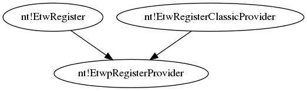

In order to fully understand what was happening, why the offset was 0x90, if the handler was really the handler, I had to RE the functions involved in the registration process. The whole explaining it, is here:

[reversing etw register process](./internal_docs/reversing_etwpregisterProvider.odt)

Besides all the study, the pretty good outcomes where that I successfully reverse two different Kernel structures (not the whole of them but the important part). The "bad" thing later was that I found the symbols of them, so they were already "documented?".

### Kernel structures for GUID and Handler (and also the status of the whole ETW system)

The outcome of the reversing part was very good. I was able to understand two involved structures and later on discover there full layout:

#### \_ETW_GUID_ENTRY

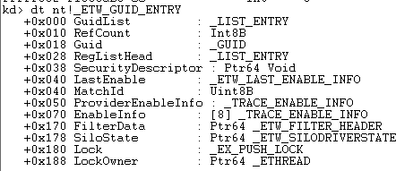

#### \_ETW_REG_ENTRY

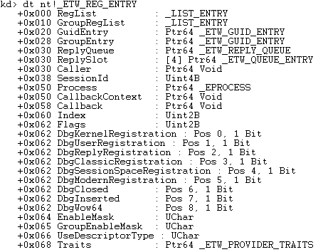

This allowed us to only focus on the **EtwWrite** part.

### Catching the Telemetry provider only with EtwWrite

Thanks to the knowledge we have on how the handler works, we are able to only set a breakpoint in the EtwWrite.
But very soon we encountered some issues:

* Which function should we use? There are a lot of type for Writing

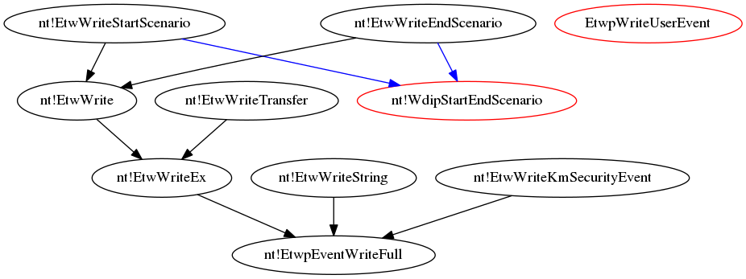

* We can't make a script to ask if the current handler's GUID is one of the ~350 providers of the Telemetry (in certain level) because the answer won't return.

I started to think if there is any possibility of linking the GUID and the HANDLER with some SILOGLOBALS and try to detect if the provider that is writing right now is linked with the logger/session of the DiagTrack.  After some time I find some very interesting function names (maybe for further analysis) but for now they didn't help me at all. Basically the entire **etwp\*** family seems to be very useful .

After some time I decide to do something manual to see if we can extract from the process something to automate. I started using a very simple script:

```windbg
bp nt!EtwWrite ".printf \"Handler: %N\\n\",@rcx"
```

Just, printing the handler each time an EtwWrite call was performed. Once I had the handler I get the GUID manually and then cross reference it with the output of the powershell command get-etw-providers (this time, without any filter, just ALL the providers of ETW).

This showed me that, most of the time, the same provider was writing. It was the following:

Key             | Value
---             | ---
SessionName     | EMPTY
AutologgerName  | DefenderApiLogger
Guid            | {E02A841C-75A3-4FA7-AFC8-AE09CF9B7F23)
Level           | 31
MatchAnyKeyword | 0x
MatchAllKeyword | 0x
Property        | EMPTY

Due to for the sake of our test it wasn't interesting, I excluded it with:

```windbg
bp nt!EtwWrite ".if (@rcx != ffffda839f0c2c50){.printf \"Handler: %N\\n\",@rcx;gc;}.else{gc;} "
```

**ffffda839f0c2c50** was the memory address of the handler.
After doing this there were just a few writings more showed up in the screen. But still there were not of our interest.

Then I decided to change, to do the same, but this time in **EtwWriteTransfer**:

```windbg
bp nt!EtwWriteTransfer ".if (@rcx != ffffda839f0c2c50){.printf \"Handler: %N\\n\",@rcx;gc;}.else{gc;} "
```

Some new handlers started to appear. After ensuring to with GUID they were related, I finally find that there was one of related to the Diagtrack:
Key             | Value
---             | ---
SessionName     | Diagtrack-Listener
AutologgerName  | EMPTY
Guid            | {E9EAF418-0C07-464C-AD14-A7F353349A00}
Level           | 255
MatchAnyKeyword | 0x800000000000
MatchAllKeyword | 0x0
Property        | 929

Once I was sure about this, I modified again the script to just listen for writes of this handler and if that happened, print the stack trace:

```windbg
bp nt!EtwWriteTransfer ".if (@rcx == FFFFDA83A036F0D0){.printf \"Handler: %N\\n\",@rcx;kc;gc;}.else{gc;} "
```

So it was manually, yes, but at least, we have our first stack trace. We still need to learn how to automate this (without taking so much time like the 360-ifs-script)

```windbg
 Call Site
00 nt!EtwWriteTransfer
01 nt!TlgWrite
02 nt!CmpInitHiveFromFile
03 nt!CmpCmdHiveOpen
04 nt!CmLoadAppKey
05 nt!CmLoadDifferencingKey
06 nt!NtLoadKeyEx
07 nt!KiSystemServiceCopyEnd
08 ntdll!NtLoadKeyEx
09 0x0
```

## Automatic detection of providers using just Write

### Still trying to automate (new idea?)

The effort of automating this continues. One strategy (I don't shared it too much) is to dump everything and afterwards do an post-analysis of the log. I've my python framework to do it, but still, I didn't find it very nice. Either way, I've set 2 breakpoints (**nt!EtwRegister** and **nt!EtwWrite**) and I'm printing the handler and the GUID in the former, and the handler together with the KC in the later. The later breakpoint is only enabled once the system has already booted. The idea is to, afterwards, use the handler as the "BRIDGE" between these two pieces of information, and use the GUID to cross check it with the ones related with the telemetry.
Anyways, this has a big problem. The GUID's that we know are linked to the telemetry, are gathered once the powershell script is executed, so it's totally arbitrary.
With this approach, if a provider manage to make a registration, write and then perform an unregistration, if we didn't issue the powershell command in the middle we are going to think that the provider is not important for us, while this is completely False.

I proposed a new idea. What if we can relate the handler that is writing, with the session that is going to write, somehow. If we can do that, then, we will just need to set a breakpoint at **nt!EtwWriteEx** (or some of them) and understand if the current provider is linked with the Diagtrack session. Anyways some questions comes to my mind:

* A provider can provide events to more than 1 session. How can we really be sure that the event that is writing is related with the session we want?
* We already know that the handlers are shared (I've seen EtwWrites performed with the same handlers but with different call stacks)

There is a structure called **WMI_LOGGER_CONTEXT** which is the representation of a session. Inside it there is a field called **ProvidersbinaryList**. We don't know yet what exactly this structure has but it could possibility help us to create a link between the logger/session and the provider.

Anyways, if we are able to do the link FROM the provider (using the handler) will be much better, due to it won't be necessary to iterate the whole double linked binary list.

### Reversing session and provider relationship

The last idea mentioned above, seems to be the best option. It will allow us to be sure if the provider is one of our interest or not.
I started doing some RE from the **nt!EtwWriteEx** in order to see if the **nt!\_ETW_REG_ENTRY** structure has something that can helped us. Unfortunately, I didn't find anything useful so far.

As we mentioned, **WMI_LOGGER_CONTEXT** has a field which seems to group all the providers linked with the session, in a double linked list. I couldn't get the link just seeing at the list, so I decided to do some RE in how the providers are attached to sessions.

I find that there is a functionality called **nt!EtwpAddProviderToSession** which seems to be the one that is doing the link. It is very deep in the call stack (**nt!EtwpRegisterProvider --> nt!EtwpProviderActiveCallback --> nt!EtwpAddProviderToSession** ). It's being also a little difficult to follow it due to it's using some functionalities which documentation is not available ( like **RtlGetImageSize** and so on). Furthermore, seems that they are dealing with binaries format **(Don't know why yet)**,

I was doing some reversing here while I found realize some interesting... So the full reverse of this will be continued

### Using Enable Trace info

There is a structure called **nt!\_ENABLE_TRACE_INFO**, which holds information about the relation ship between a provider and the session (BINGO!). Inside the handler structure, we found one (seems to be special) of this guys and afterwards an array of 8 of them. Doing some empiric (TODO: Find this in the code) tests, I realize that if a provider is enabled for a session, then the "special" one will have the **activated** field in 1, but nothing in the **loggerid** field. Seems that this "special" is only for telling that the provider is enabled, but if you want more information about it you should go to each bucket of the array. Experience tell that if the "special" has the field **activated** in 1, there must be at least one bucket in the array with information about a session. There, you'll find, in the **loggerid** field, so this is our link to the session!.

I've developed a script that, once it ensures that the provider is active for some session (asking this to the "special") then it iterates the array to search for the session of telemetry. Anyways, I still have some questions to solve:

* How to get the **loggerid** of the Diagtrack Session in runtime (I almost sure it can change, right now is hardcoded in the script)
* Again, based on empiric tests, I'm almost sure that if the provider is activated for 3 different sessions, then only the first 3 buckets of the **nt!\_ENABLE_TRACE_INFO** array will be filled. So, the while structure that is inside the script is considering this as breaking once we found a bucket that is not activated. (**Is it really like that?**).
* What about the flags of the provider? Each link between a session and a provider has its own **keywords** ? How can be really sure that the event that is going to be logged is really going to be logged and is not going to filtered afterwards by the flags of the session? Read, at least, providers paragraph from [document](https://blog.mozilla.org/sfink/2010/11/02/etw-part-3-architecture/)

### A stumble is not a fall

After finishing developing the script, I tested against the **loggerid 0x21**, but the breakpoint was never reached. I was really dizzy, because according to the logic it should work. I spent an entire day trying to figure it out what was happening. Finally, after reversing the behavior of **nt!EtwWriteEx** and **nt!EtwpEventWriteFull** I confirmed that my logic was OK. In some part of the latter, (identified in the ida db) it starts "iterating" each **nt!\_ENABLE_TRACE_INFO** bucket of the structure, getting the **loggerid** and doing some comparison using masks.

The key thing I didn't realize is that I was just paying attention to the **EnableInfo** (the array) of the  **Guid entry** pointed by the handler, but not paying any attention to the **Group Entry**. The handler structure (shown some sections above) has two different entries (offsets: 0x20 and 0x28) which are of type **nt!\_ETW_GUID_ENTRY**. Although, I should continue looking to better understand the meaning of the group entry and how a group if build, at least, I can be sure that there is our answer. How can I be sure? I put a breakpoint in "nt!EtwWriteEx" with a GUID of a known telemetry provider, and once it jumped I started analyzing there structure. Although, the GUID entry wasn't enabled for anyone, the group entry was, and in fact was enable for the 0x21 which is our logger =D.

### The phoenix rises from the ashes

Finally, I was able to solve the issue. My following step was to create 2 different scripts. The first one is going to detect the logger id automatically for the "Diagtrack-Listener" once the session it started. Once we have the logger id linked to the Telemetry session, we are going to store it in a particular register and then set a breakpoint in **nt!EtwWrite** function, which will hold the second script. The latter, is a script which will analyze both, the Entry Guid and the Group Entry of the handler provided by parameter. In each of them, will iterate the **EnableInfo** list looking for providers that are activated and also linked to the **logger id** that we just recovered from the previous script. If all this conditions are accomplished, the call stack will be printed out.

### Real Telemetry providers ?

One of the questions that came to my mind while I was doing this was: Ok, we have the link to the session... but is there other way of confirming that these providers are really connected with the Telemetry?.
Then, I remember the previous strategies that I tried to followed and remembered that old dirty Powershell script that will give you back information about each provider related with that session. This must help.

I was printing each time I captured an ETW Write related with the telemetry, either the GUID or the Group Guid. Doing some post-analysis I realise that the GUID was always the same, which seemed (at least to me) something strange. Even worst, when I tried to look it up in the telemetry related providers (according to the output of the EtwProvider) I couldn't find it.

Maybe it was obvious, but for me it wasn't. After taking two minutes to think was possible could happened, I got some idea. Most of the time, the GUID that was being printed came from the part of the script where the GROUP Entry was the one involved, and not the GUID entry itself. So, the GUID that the script was printing, wasn't the one related with the provider but the one related to the Group of providers. Some time later I understood that even though the provider itself is not activated to log in that session, because it is registered in a group that it is, then it will log the events anyways. This took me to add a line to the script: When printing the group GUID, print also the **Provider Guid**.

After doing this, I was able to confirm that the providers that were writing because they were registered in a Group who was related with this session, were the ones related with the Telemetry by doing a cross check with the output of the Powershell script.

### Are we breaking in the correct place ?

Once thing that was triggered in certain moment was.. Are we really breaking in the correct place?. I was looking and trying to understand how  the **level**  and **keywords** affect the "writeness" of the events. Here is some [documentation](https://docs.microsoft.com/en-us/message-analyzer/system-etw-provider-event-keyword-level-ettings#BKMK_FindingKeywords) that helped me a lot understanding how this works. The thing is that if the **level** and **keywords** of the event that wants to be written (**EVENT_DESCRIPTOR**) "don't match" the ones specified by the provider, the event won't be written at all. Right now, we're setting the breakpoint when the **nt!EtwWriteEx** is called, but... the filtering is carried out afterwards :

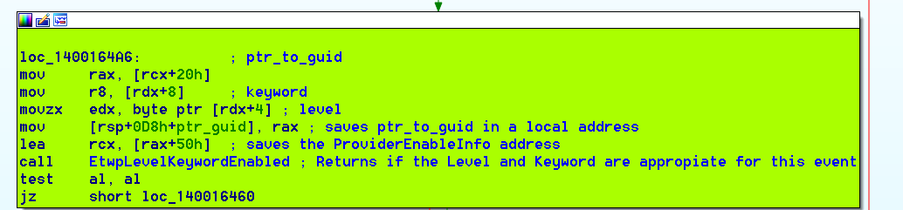

That picture illustrates a basic block inside the **nt!EtwWriteEx** function. As we can see there, first **level** and **keywords** of the event are compared against the ones stored in the Handler structure. After, and only after this conditions is accomplished, a call to **nt!EtwpEventWriteFull** is performed:

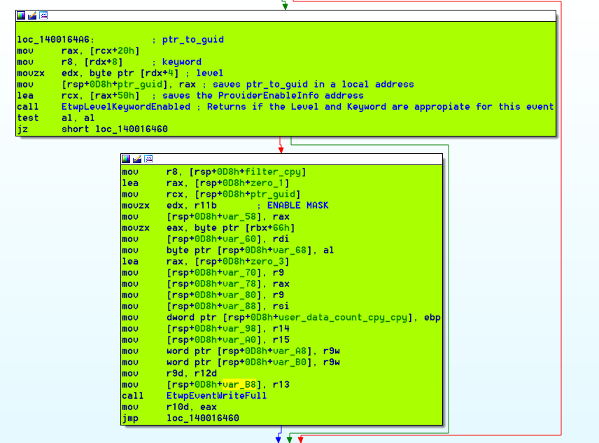

An "almost-identical" piece of code is executed for the **Group** part.

Based on this, what we can do is move our breakpoint at the initial part of **nt!EtwWriteEx** to immediately previous instruction before calling **nt!EtwpEventWriteFull**. Because in that moment, we are going to be sure that the event was going to be written. So now, we have two breakpoints instead of one (In fact, we have 3 because we also have the one related to get the logger id of the Telemetry.)

Despite the fact that shifting the breakpoints a little bit deeper sounds more accurate. I still have one question. As far as I know, the "filtering" occurs in two different parts: at the provider level (what we have discussed) and at session level:

* The session has also flags that should match with the event ones? **The session hasn't flags. The session configures the provider with flags. So, the "provider flags" are the ones that the session set to it in order to log only those type of events.**
* Where is that piece of code? **Is the part of nt!EtwpLevelKeywordEnabled**
* Should we compare it in our scripts in order to be even more sure that the event was going to be really written in the memory buffers of the session? **Setting the breakpoint in the new place should solve this.**

### Fully reversing of EtwpEventWriteFull

During the development of the first trigger, a new problem was triggered. Although we were able to successfully reach the breakpoint using the triggered developed, I wanted to really check that the events were being logged. The way I found to do it was issuing the following parameter:

```windbg
!wmitrace.eventlogdump LoggerID
```

After using the trigger to generate 100 events I went to check the state of the buffers, but unfortunately they were empty. Some moments after, some events appeared (don't know if related with the manually triggered or not), so I went to execute again the trigger. When I went back to the buffers to check if there were any changes, unfortunately the news was bad, no new events. The buffers looked exactly the same as before executing the trigger.

So, in order to understand what was happening I had to do the complete path of writing the events. Here is how I did it:

The **EtwpEventWriteFull** is a **HUGE** function. It receives 17 parameters and has almost 1k of lines, so this work took me between 2 and 3 days. Of course it's almost impossible to show all the functionalities what I will stress some of them:

* Identifying session (and checking event enabled)
* Get buffer to write

### Identifying session

One of the very first things that the function does is to identify to which of the attached sessions of the provider the event should be logged. In order to carried it out, it makes use of the **EnableMask** field of the handler structure. This field is a 8-bit array which holds the information of which of the **EnableInfo** objects in the guid structure are enabled.

First thing is to get the index of the least significant bit of inside the **EnableMask**.
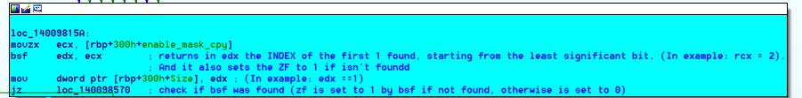

Then, makes two interest things:

The first one is that it decrease the value of the iterator (a copy of the original **EnableMask** at the beginning) by 1 and afterwards an AND between the previous value and the current one. Why? Because this way, it sets the current bit (already analyzed) of the iterator to 0, without modifying the upper ones. The less significant ones have been already analyzed (because that's the way this function follows by using the BSF instruction) and the most significant ones should not be affected. Example:

```raw
11100000 <-- Iterator
11011111 <-- Iterator - 1
======== <--- AND
11000000
```

The second thing is how the index inside the bit array, ends being also the index inside the **EnableInfo** array. Once it gets the index, it's uses the instruction **SHL** to multiply it by 32 (shifting to the left 5 times is the same as multiplying the number by 2^5). Why? Because 32 (0x20) is the size of **EnableInfo** object. Afterward, it adds to this value, the address of the handler structure, and stores it in **r14**. Meaning that in this register we have the base address of the handler + the offset (related to the base address of the array of **EnableInfo** inside the structure) of the corresponding object.

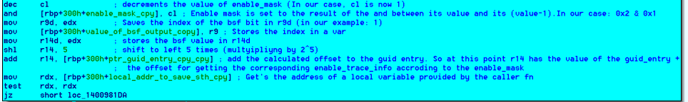

Finally, in order to get the real object and its data, it adds 0x70, which is the offset where the **EnableInfo** array is placed inside the handler structure. Finally, it calls the **EtwpLevelKeywordEnabled** function.
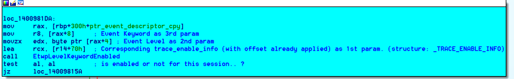

### Get buffer to write

After doing some checks related with flags and stuff it finally end up getting a pointer to the **nt!\_WMI_LOGGER_CONTEXT** of the session and calling the function **EtwpReserveTraceBuffer** giving this pointer as parameter (among others)

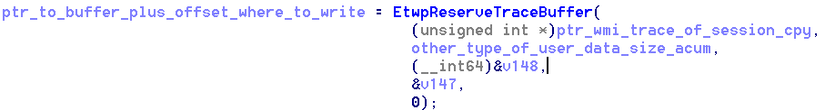

**Reversing EtwpReserveTraceBuffer**

First of all it performs some basic validations to ensure that everything is going well (accept new events? is the event size bigger than the max value?)
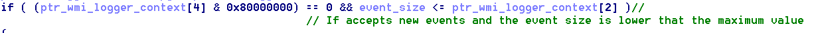

Afterwards it gets into a for, where the first thing it does is to get the value from a part:


After finding some documentation I figured it out that the GS segment always points to the **THREAD** structure (TEB) of the current process. Anyways, I wasn't able to understand what kind of data was in that offset.. Anyways, the following statement clarify me a **LITTLE** bit this situation.

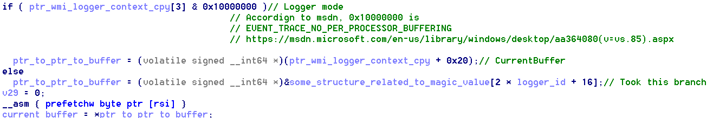

Here we can see that it will go to that address to get a pointer to pointer to a buffer only if the current ptr to the wmi logger context has not set the **currentBuffer** field. So maybe, that offset is the base address of ptrs for all the buffers of the ETW? (because it uses the loggerId field to get the pointer). It's important to notice that the last statement of the picture, makes finally to get the real pointer to the buffer.

Once it gets the real pointer, it cleans some part of it (didn't get why, but after the cleaning I compared it against the value that the !wmitrace command issued, and the address was the same as the first buffer of the Diag Track session).

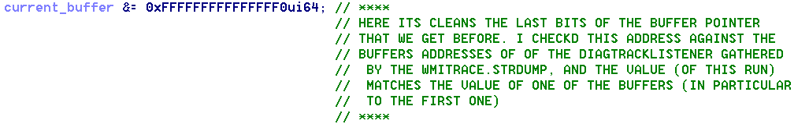

Then, it looks for the current offset of this buffer, in order to know from which offset it should start to write the data. This is performed by looking at the offset 8 due to seems that the structure which is placed there is **nt!\_WMI_BUFFER_HEADER**. 

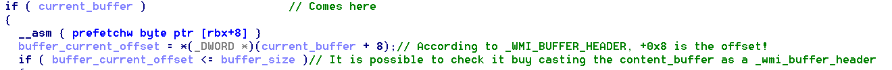

Afterwards, in enters into a cycle, looking for some buffer which can hold the event. If the current buffer cannot do it, then it will call to a function named **EtwpSwitchBuffer** which (I guess) will give you other buffer to test. So, it performs this by comparing the buffer size  against the sum of the current offset plus the size of the current event. 

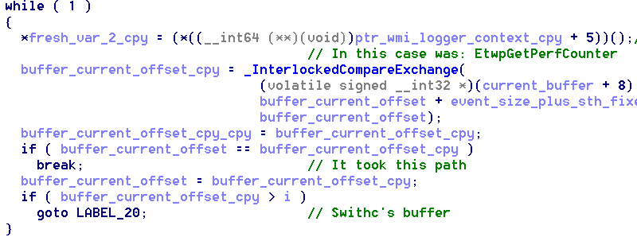

Finally, once the check to ensure that the buffer is able to hold the data finishes, it writes some of these pointers in the fresh variables that were passed by parameter and returns the address of the first byte were the function is able to write data (address of the buffer plus the offset).

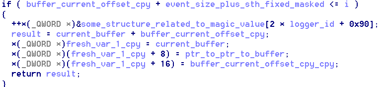

**Going back to the upper level**

Once it gets the memory address where it can start writing the data, it does it :)
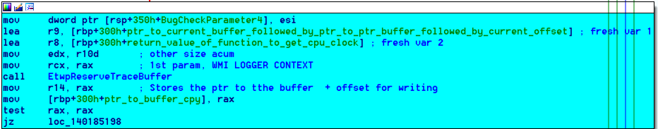


**I didn't finish reversing the whole function, after this it continues doing some stuff. At least it should do 2 more things:**

* **Write the content of the event itself.**
* **Clean and remove old (?) events (this action was detected when solving the major bug (next section)).**

Here is the windbg raw commands (I erased the half of them) that allowed me understand that the event was correcly stored:

```windg
kd> !wmitrace.logger 0x21
(WmiTrace) LogDump for Logger Id 0x21
    Logger Id 0x21 @ 0xFFFFC604C3F77B80 Named 'Diagtrack-Listener'
      CollectionOn        = 1
      LoggerMode          = 0x08800110 ( rt ind 0x00000010 )
      HybridShutdown      = persist
      BufferSize          = 64 KB
      BuffersAvailable    = 3
      MinimumBuffers      = 4
      NumberOfBuffers     = 4
      MaximumBuffers      = 6
      EventsLost          = 0
      LogBuffersLost      = 0
      RealTimeBuffersLost = 0
      LastFlushedBuffer   = 0
      MaximumFileSize     = 0
      FlushTimer          = 300 ms
      LoggerThread        = 0xffffc604c3f7b080 (30 context switches)
      PoolType            = NonPaged
      SequenceNumber      = 24
      ClockType           = PerfCounter
      EventsLogged        = -1
      Consumer @ 0xffffc604c41b88d0

      Buffer      Address           Cpu RefCnt State
      ===========================================================================================
      Buffer   1: ffffc604c3f83000 ,  0:  15    General Logging    , Offset:       72 ,   0% Used
      Buffer   2: ffffc604c3f93000 ,  0:   0    Free List          , Offset:      360 ,   0% Used
      Buffer   3: ffffc604c55af000 ,  0:   0    Free List          , Offset:     1288 ,   1% Used
      Buffer   4: ffffc604c55bf000 ,  0:   0    Free List          , Offset:     1056 ,   1% Used
kd> !wmitrace.buffer ffffc604c3f83000
Buffer @ ffffc604c3f83000 -- 0x10000 (64 K)
    RefCount      = 15
    Logger        = 'Diagtrack-Listener' (33)
    Processor     = 0
    State         = 0x1
    SavedOffset   = 0
    CurrentOffset = 72
    Offset        = 832
    TimeStamp     = 339730597
    Seq           = 21
    BufferFlag    = 0x0
    BufferType    = 0
Buffer is empty.

============== ===== ========== ========== ============
Header         Count EventSize  HeaderSize AvgEvntSize
============== ===== ========== ========== ============
kd> p
nt!EtwpReserveTraceBuffer+0xba:
fffff802`7b29d06a 0f0d4b08        prefetchw [rbx+8]
kd> r ecx
ecx=10000
kd> !wmitrace.buffer ffffc604c3f83000
Buffer @ ffffc604c3f83000 -- 0x10000 (64 K)
    RefCount      = 15
    Logger        = 'Diagtrack-Listener' (33)
    Processor     = 0
kd> p
nt!EtwpReserveTraceBuffer+0xc2:
fffff802`7b29d072 443bf9          cmp     r15d,ecx
kd> r r15d
r15d=48
kd> p
nt!EtwpEventWriteFull+0x3c1:
fffff802`7b3163b1 418906          mov     dword ptr [r14],eax
kd> p
nt!EtwpEventWriteFull+0x3c4:
fffff802`7b3163b4 0fb78538030000  movzx   eax,word ptr [rbp+338h]
kd> p
nt!EtwpEventWriteFull+0x3cb:
fffff802`7b3163bb 6641894604      mov     word ptr [r14+4],ax
kd> p
nt!EtwpEventWriteFull+0x3d0:
fffff802`7b3163c0 0fb78540030000  movzx   eax,word ptr [rbp+340h]
kd> p
nt!EtwpEventWriteFull+0x3d7:
fffff802`7b3163c7 6641894606      mov     word ptr [r14+6],ax
kd> p
nt!EtwpEventWriteFull+0x3dc:
fffff802`7b3163cc 488b8580000000  mov     rax,qword ptr [rbp+80h]
kd> p
nt!EtwpEventWriteFull+0x3e3:
fffff802`7b3163d3 0f104018        movups  xmm0,xmmword ptr [rax+18h]
kd> p
nt!EtwpEventWriteFull+0x3e7:
fffff802`7b3163d7 410f114618      movups  xmmword ptr [r14+18h],xmm0
kd> p
nt!EtwpEventWriteFull+0x3ec:
fffff802`7b3163dc 488b4540        mov     rax,qword ptr [rbp+40h]
kd> p
nt!EtwpEventWriteFull+0x3f0:
fffff802`7b3163e0 0f1000          movups  xmm0,xmmword ptr [rax]
kd> p
nt!EtwpEventWriteFull+0x3f3:
fffff802`7b3163e3 410f114628      movups  xmmword ptr [r14+28h],xmm0
kd> p
nt!EtwpEventWriteFull+0x3f8:
fffff802`7b3163e8 488b8548030000  mov     rax,qword ptr [rbp+348h]
kd> p
nt!EtwpEventWriteFull+0x3ff:
fffff802`7b3163ef 4885c0          test    rax,rax
kd> !wmitrace.logger 0x21
(WmiTrace) LogDump for Logger Id 0x21
    Logger Id 0x21 @ 0xFFFFC604C3F77B80 Named 'Diagtrack-Listener'
      CollectionOn        = 1
      LoggerMode          = 0x08800110 ( rt ind 0x00000010 )
      HybridShutdown      = persist
      BufferSize          = 64 KB
      BuffersAvailable    = 3
      MinimumBuffers      = 4
      NumberOfBuffers     = 4
      MaximumBuffers      = 6
      EventsLost          = 0
      LogBuffersLost      = 0
      RealTimeBuffersLost = 0
      LastFlushedBuffer   = 0
      MaximumFileSize     = 0
      FlushTimer          = 300 ms
      LoggerThread        = 0xffffc604c3f7b080 (30 context switches)
      PoolType            = NonPaged
      SequenceNumber      = 24
      ClockType           = PerfCounter
      EventsLogged        = -1
      Consumer @ 0xffffc604c41b88d0

      Buffer      Address           Cpu RefCnt State
      ===========================================================================================
      Buffer   1: ffffc604c3f83000 ,  0:  15    General Logging    , Offset:     1072 ,   1% Used
      Buffer   2: ffffc604c3f93000 ,  0:   0    Free List          , Offset:      360 ,   0% Used
      Buffer   3: ffffc604c55af000 ,  0:   0    Free List          , Offset:     1288 ,   1% Used
      Buffer   4: ffffc604c55bf000 ,  0:   0    Free List          , Offset:     1056 ,   1% Used
kd> !wmitrace.buffer ffffc604c3f83000
Buffer @ ffffc604c3f83000 -- 0x10000 (64 K)
    RefCount      = 15
    Logger        = 'Diagtrack-Listener' (33)
    Processor     = 0
    State         = 0x1
    SavedOffset   = 0
    CurrentOffset = 1072
    Offset        = 832
    TimeStamp     = 339730597
    Seq           = 21
    BufferFlag    = 0x0
    BufferType    = 0
Event64    @ +00048 (1000)

============== ===== ========== ========== ============
Header         Count EventSize  HeaderSize AvgEvntSize
============== ===== ========== ========== ============
Event64         1       1000    80      1000   
============== ===== ========== ========== ============
Total           1       1000    80      1000   

```

## Solving MAJOR bug

As I said we had a very important bug that lead us not to thought that our trigger was good, but in fact it wasn't  working at all. IN this section I will describe how I did to solve it and how I ensure that right now is working.

## Solving the bug

The bug resided in the our windbg scripts. The **EtwWriteEx** functionality (where we are setting the breakpoints), can make two different calls to **EtwpEventWriteFull** depending if it will write because the provider itself or because the provider's group. As I discussed this before, we set breakpoints in the immediately previous instruction of both calls. The problem was some we were executing exactly the same script for both. This script was first checking if the related Handler was enable either because of the provider itself, or because of a group to write in the Diag-track Session.  So, the problem was basically, that if a provider was going to write an event totally related with OTHER session, BUT this provider was also related because of the providers group to the DiagTrack Session, then I'll consider it that it was going to write to this session, which is totally wrong. The other way around, could happened also (check group and write because of the provider itself), but I never say it.. basically due to most of the time the providers related with the telemetry session are related due to be part of a provider's group which is in fact related with it.

The solution was easy, I create the same script (but changing just the GUID entry to use) and only check for the corresponding entry. Therefore if the call is going to be done because of a provider's group, we are going to analyze just the group guid entry. The same happens when the call is because the provider itself.

## How can I be sure that right now is working well? 

I have a way to trigger 1 event which really affects the DiagTrack session. What I did to ensure this was to display the events that were related to the telemetry in the moment before of calling the **EtwpReserveTraceBuffer**. But, calling even **EtwpEventWriteFull** (in the exactly place were we set our breakpoints) I printed the **_EVENT_DESCRIPTOR** structure to understand which was the event to log. Afterwards I set the breakpoint to the aforementioned location.

```windbg
dt nt!_EVENT_DESCRIPTOR @r13
bp nt!EtwpEventWriteFull+0x286 ".if(r12d == 0x22){.echo 'YEP! it entered';.ech ''}.else{gc};gc;"
```

* 0x22 was the logger id of the diag track in that moment
* ".ech" is not a typo, but a way to get the control of the execution in the windbg console.

With this command I was able to ensure that:

* The write it's related to the diagtrack listener.
* Its almost sure that it will write in the buffer

Once I was here, I displayed the events and enable a new breakpoint:

```
!wmitrace.eventlogdump 0x22
bp nt!EtwpEventWriteFull+0x3c1
```
That location is few instructions after the call to **EtwpReserveTraceBuffer**. Meaning that once we reached it, the new event should be already written in the buffers. So later, I continued with the execution (**g** command), print again the events, and compared them.
Also, to be sure that I was still in the same call (maybe when I press the continue key, it jumped to another write.. I could solved this putting more breakpoints also), I re-check that the **_EVENT_DESCRIPTOR** remained the same.

About the comparison:

* A new event appeared with the event id that the  **_EVENT_DESCRIPTOR** was showing (meaning that it was stored correctly)
* The amount of events went from 32 to 22. Meaning that the **EtwpReserveTraceBuffer** function doesn't only add new events but also it removes (based on time? based on what? We should reverse that part also.)

**Another interesting thing that can be gathered from this last part is that we could move the current place of the breakpoints, to inside the EtwpEventWriteFull because there we have the pointer to the WMI_TRACE_LOGGER structure that will be using, and therefore we can get the logger id. This will be more exactly, because we can know if the event will be really written or event more, I think we can detect when an event is going to be lost. The counterpart of it could be that maybe this function could be called lot of times and it may have a big overhead. We should test it.**

## Outcomes of the bug found, detection improvement

So after finding & fixing this bug, the next step was to do the same process again but this time in a good way :P. I set a breakpoint at **EtwpReserveTraceBuffer** and realized that the **EtwpEventWriteFull** wasn't the only function that was calling it to write stuff related to the Diag Track session. After undestanding that the first parameter for this function was the **_WMI_LOGGER_CONTEXT** structure, it was easy to figured it out when a write was related with the telemetry session. 

With a quickly test another function that was calling it was **EtwpWriteUserEvent**. My next step was to X-reference all the calls to the **EtwpReserveTraceBuffer** functionality. Besides this two, there were a couple more of functions (maybe 5/6). We agreed with Aleks that the best way would be to run an analysis of one day to see which functions to write events related with telemetry are calling **EtwpReserveTraceBuffer**, so we can have a subset of functions to analyze, because the other may not be used by the telemetry at all.

My idea right now is to, once this breakpoint is reached, step out from the function, and print the provider id and the data related to the event. The thing is that in **EtwpReserveTraceBuffer** we only have the information of the session, and the event size. The data related to the event and the provider itself, are in the caller function (which could be any of the X-referenced ones). Each of them will have the information in different registers/offsets, so we have to analyze each of them and understand how to get the data from them.

After a test of 1-day logging, we only identify two different functions:

* **EtwpEventWriteFull**.
* **EtwpWriteUserEvent**.

So, my next step will be reverse them, to identify how can we get the provider ID and the actual data of the events before logging them.

## Getting the event data before even logging them. (deprecated)

Before going in details on each function, it's important to understand the layout of the events.These events, usually, have the following structure:

```xml
 <Event xmlns='http://schemas.microsoft.com/win/2004/08/events/event'>
  <System>
   <Provider Name='' Guid='{487d6e37-1b9d-46d3-a8fd-54ce8bdf8a53}'/> <!-- GUID -->
   <EventID>     2237   </EventID> <!-- _EVENT_DESCRIPTOR -->
   <Version>     0   </Version> <!-- _EVENT_DESCRIPTOR -->
   <Level>     5   </Level> <!-- _EVENT_DESCRIPTOR -->
   <Task>     0   </Task> <!-- _EVENT_DESCRIPTOR -->
   <Opcode>     0   </Opcode> <!-- _EVENT_DESCRIPTOR -->
   <Keywords>     0x800000000800   </Keywords> <!-- _EVENT_DESCRIPTOR -->
   <TimeCreated SystemTime='2018-05-14T13:13:39.758880300Z'/> <!-- CPU_INFO -->
   <EventRecordID>     5   </EventRecordID> <!-- EVENT ID -->
   <Correlation/>
   <Execution ProcessID='788' ThreadID='792' ProcessorID='0' KernelTime='2' UserTime='3'/>
   <Channel>   </Channel>
   <Computer>     DESKTOP-T92Q5RT   </Computer>
   <Security UserID='S-1-5-18'/>
  </System>
  <ProcessingErrorData>
   <ErrorCode>     15003   </ErrorCode>
   <DataItemName>   </DataItemName>
   <EventPayload>     140300000100CC006922D65283EBD3010101140300000100CC006922D65283EBD301DDEF185083EBD3012A6900004F5B000001000000010000004F5B00004F5B000000000800FE3F0000000000000200010001000000000000008007F7038007F703001060EA0000C0D40100D0070000310000004F5B000000000000000000000200000000000000   </EventPayload>
  </ProcessingErrorData>
 </Event> 
```

Fortunately, thanks to the reversing of **EtwpEventWriteFull** we already identified where is stored the **GUID**, **_EVENT_DESCRIPTOR** , **CPU_INFO** and **EVENT_ID** at least for this function. 

## Getting the some event data before logging and the rest after.

I figured it out that there wasn't any reason to try to get all the data before logging it. I also realized that there is another function of the **!wmitrace** extension that it's very useful: **logdump**. This function shows you the data related with the event itself (I guess it's the payload). Although this should be validated with the guys that are analyzing the network traffic of the telemetry, I'm pretty sure that this data is the one we need.

Anyways, the outputs of both functions, are totally different. One is focus on the event metadata (Provider name and guid, event descriptor, etc) as shown above, and the other totally focus on the event payload (**!wmitrace.logdump**):

```json
[0]0DAC.1124::  131709486455208610 [Microsoft.Windows.WindowsErrorReporting/WerReportSubmit/]
{"ReportId": "f8fe32e8-4c5c-11e8-a936-cdbcf1022e84", "IntegratorReportId": "", "EventName": "WindowsUpdateFailure3", "SignatureParamCount": 10, "SignatureParameter01": "10.0.14393.0", "SignatureParameter02": "8024402c", "SignatureParameter03": "00000000-0000-0000-0000-000000000000", "SignatureParameter04": "Scan", "SignatureParameter05": "0", "SignatureParameter06": "0", "SignatureParameter07": "8024500b", "SignatureParameter08": "UpdateOrchestrator", "SignatureParameter09": "{9482F4B4-E343-43B6-B170-9A65BC822C77}", "SignatureParameter10": "0", "SubmitFlags": 2147483648}
```

Even better, I found that if you ran the following command, only the last event will be shown:
```windbg
!wmitrace.logdump [LOGGER_ID] -t 1
```

This means that the task of showing the content of the last logged event, it's pretty straightforward.

Besides from the general data, I also wanted to show the GUID and _EVENT_DESCRIPTOR structures of each call. That's why I had to reverse a little both functions to understand in which offset was each value.

I checked that everything was working by displaying ALL the events logged and comparing if just the last shown was the new one. Every time I did it worked :) 

## Bug related with the amount of repetitions of the json payload

When I finished developing the first version of the scripts, I realized that sometimes (don't know why) the **logdump** command wasn't being triggered, and sometimes it was being triggered more than once in the same write. I did some workaround in the FMW, but of course I started searching for the root cause.

After a couple of hours, I found the cause. The **gu** command inside scripts is not very stable. Although the documentation of WINDBG says that commands that continue with the execution shouldn't be used because they will ignore the following statements, **gu** triggers a warning but it executes the following statements anyways. Anyways, seems that because of some reason, it is not too stable and therefore causes some issues sometimes.

In order to fix it, I changed my way of achieving the same goal of **gu**. I set a one-time breakpoint in the same function (but in the last part of it) and then executed the **gc** command. Once this breakpoint is triggered, we can print the json body of the event, due to at this time, the event has been already written. Also, I added a check, once this breakpoints is reached, to ensure that we are still in the same "write", by comparing the current provider and the event descriptor. The probability of both being the same in exactly the following run of one of the two functions (
**EtwpEventWriteFull**, **EtwpWriteUserEvent**) is pretty pretty pretty low.

I didn't come across the case where the are different yet, don't think so it exists. Still, I entered a typo in that case so that I can get the control of the debugging session and analyze what happened.


## Really ensuring we are logging the correct events

In a previous section I wrote about ensuring that we were logging the correct information. According to the content of the buffers, it was almost clear that we were doing the correct thing, but I wasn't 100% sure.

In order to be completely sure about it, I had to extract the events that the Telemetry is really sending to the Microsoft Back-end servers. I went to Thomas and ask him if he could show me the framework they created in order to check this. Finally, the framework wasn't necessary.. He told me that what I should do is use the Message Analyzer and xperf tools... How? 
**xperf** allows you to create an ETW session, therefore we can start a new session with the same providers as the diag track doing sth like this:

```
xperf -start UserTrace -on Microsoft-Windows-Diagtrack+43ac453b-97cd-4b51-4376-db7c9bb963ac+da995380-18dc-5612-a0db-161c5db2c2c1+6489b27f-7c43-5886-1d00-0a61bb2a375b -f C:\tmp\diaglog%d.etl -FileMode Newfile -MaxFile 50
```

This will create a .etl file with all the data related with the DiagTrack. Afterwards, this type of file can be opened using the **Message Analyzer**. This powerful tool allows you to read the events in a very graphic way. So, in order to do some easy quick checking it's very good, but if we have to do something larger, won't scale at all.

That's why I developed a little script, that takes as input the .etl file and outputs all the events on it. 

Nevertheless, isn't easy to understand all the information that the **Message Analyzer** is providing. I'm not sure 100% of this (I have a little yes from Thomas but I should check it again) but there is a particular "Series" or "Task Name" that is called **RingBuffer_EventAddedSuccessfully**. Usually, inside on it, resides all the events in a raw way (in fact, there are part of a bigger JSON object under the **data** key). I didn't get the real meaning of the "Task Name" or "Series", but I think they are some parsing stuff that the tool performs of the real events to better present them. Therefore, what I understand so far, is that only the aforementioned Task Name is the only import part. 

I compared the events that I was able to get from the windbg scripts and the one presented by the **Message Analyzer** and the differences are very little. Yes, there are differences. With the WINDBG scripts more events were captured (potentially related with the providers that were added to the session). In terms of the real content of each event, they're almost the same, with a little difference (spaces, dates that were parsed, etc). 

Another thing that I found, is that the content of the Task Name **MatchEngine_ProcessEvent** has the event id type (in my windbg script is shown in hexa because I get the value directly from the Event Descriptor), the type and a some other information related with each event. 

Either way, I should continue with this analysis because seems that it needs some time.

# First and a half milestone: Visualization framework

After finishing with the development of the scripts, Alex asked me to create a kind of FW to visualize the data extracted. It should run natively in Windows, therefore I should use some native technology (# or Powershell). One of the things we have to further discuss (with myself) is which type of visualization we want.

# Second milestone: Find Triggers

I took an arbitrary call stack of one of all gathered from the windbg script output and start trying to reverse the conditions in order to achieve the trigger of the event. I was writing this document (because was the first time I did this, I won't repeat this doc for every trigger (I guess)) [reversing etw register process](./internal_docs/reversing_etwpregisterProvider.odt). The thing was that while I started doing this, Aleks asked me to develop a framework in some native language # or Powershell, that could parse the information extracted from the scripts and make some nice outputs (still thinking what kind of outputs).

## Family of events

Once thing I realized while I was researching each trigger is that what we want is to try to cover as much providers and as much events as possible. Which means that if we are going to log the same event using two different call stacks, it won't be very useful. **I really should take this into account**

## First trigger (Just a dream... we use to had a MAJOR bug rememba?)

In order to start with this part, I arbitrary chosen one call stack from one analysis I made. The call stack is:

1. **nt!EtwWriteEx**
2. **nt!EtwWrite**
3. **nt!PopDiagTracePowerRequestChange**
4. **nt!PoSetPowerRequestInternal**
5. **nt!PopPowerRequestActionInfo**
6. **nt!NtPowerInformation**
7. **nt!KiSystemServiceCopyEnd**
8. **ntdll!NtPowerInformation**

So far I'm stuck with the way of getting the object from the handler. I want to see how the structure is build. I need it because some conditions depend on specific values of them. I've created a [doc](./internal_docs/reversing_power_information.odt) where I wrote down all the problems I've experienced.

### Creating PowerRequest

After a couple of days reversing stuff (as shown in the attacked doc) I started finding some useful relations. The first thing I understood was that this call-stack was directly related with a type of object called **PowerRequest**. Besides from the research I did and wrote in the doc, some days later I understood that this kind of object was related with the **Power Management** component of Windows. [Documentation](https://docs.microsoft.com/en-us/windows-hardware/drivers/kernel/windows-kernel-mode-power-manager)

My first idea was to try to create a **PowerRequest** object, manipulate it, get a **handler** to it, and give it to **ntdll!NtPowerInformation** with the rest of the parameters we already reversed. I found that, in order to create this kind of object, you should use the function **PoCreatePowerRequest** [docu](https://docs.microsoft.com/en-us/windows-hardware/drivers/ddi/content/ntifs/nf-ntifs-pocreatepowerrequest) which receives a pointer to a **deviceObject**. 

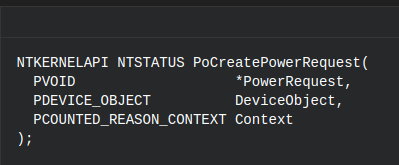

So, clearly, this kind of objects were totally related with devices. My following idea then, was to put a breakpoint in this function once I boot the system, hoping it won't be hitted too much times. Fortunately it was hitted only twice (in fact, three times, but the third was the same and the second). I wanted to understand more about this devices, that's why I print the structure of the devices ones the breakpoint was reached:

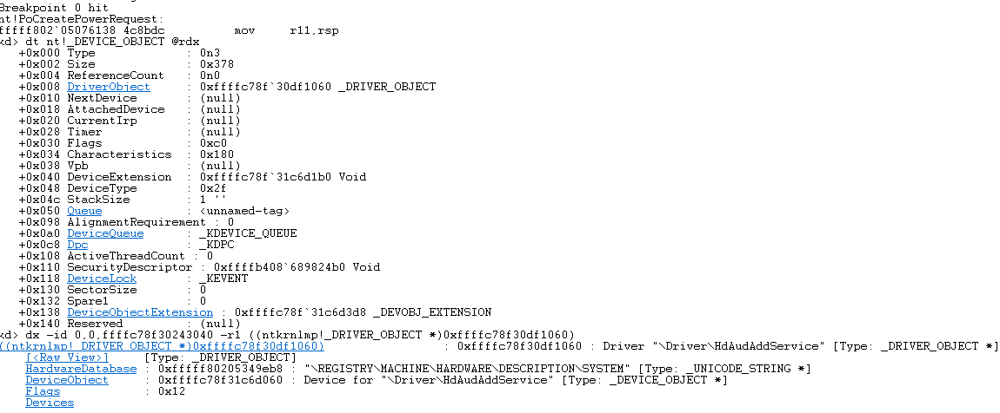

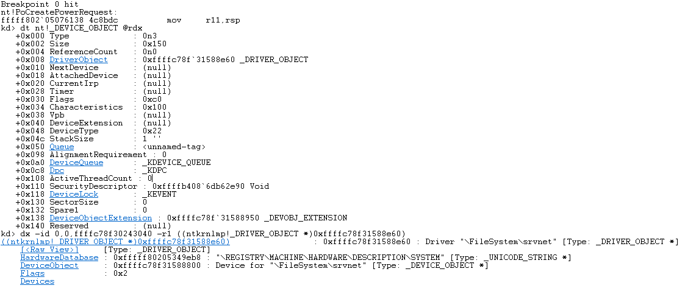

With help of some documentation ([DEVICE_OBJECT](https://msdn.microsoft.com/library/windows/hardware/ff543147),[DEVICE_TYPES](https://docs.microsoft.com/en-us/windows-hardware/drivers/kernel/specifying-device-types)) I finally understood that they were to drivers (in particular, paying attention to the type of device and the name of it).

So my idea was to: 

1. Get the device object.
2. Get a handler to it, and give it to the **PoCreatePowerRequest** in order to get a **PowerRequest** object.
3. Get a handler to it, and call the **ntdll!NtPowerInformation**.

Later, I realized also that **Device Objects** are generally contained inside **Driver Object**s and therefore, I should first find one of them.

### Re using PowerRequest

In some moment of this research, I thought that maybe, it wasn't necessary to create my own **PowerRequest** object, but use the same that the system was using when booting. But.. how to get the pointer to the **PowerRequest** of some of those?

My final idea was to do some manual testing. Due to one of the names of the drivers that created a **PowerRequest** object (according to the breakpoints) was **\Driver\HdAudAddService** I started thinking how to trigger this guy. Without too much effort, I finally discovered how. Make him do some task!

From manual testing, I got that voluming up and voluming down, seemed to trigger the breakpoint of the etwWrite related with DiagTrack. Therefore, I developed an .exe which will perform that task automatically. Unfortunately, when I executed the .exe,  no breakpoint was reached. But I knew I was close. In that moment, I thought that I should use my headset due to we were working with the audio driver. That was my best decision ever. Once I put on my headset I realized what was hitting the breakpoint: **playing sound**!!!.

My next move was to change the scripts, and instead of modifying the volume, I just played a system sound, hundred of times. The result were positive, analyzing the graphic made by the **DataVisualizator** we can see how each time we execute our trigger, how the amount of writes increase proportionally.

What means, that we have a PoC of our first trigger.

## Lets hunt triggers

After solving the major bug and using the new developed windbg scripts, I started again to search for real triggers. My strategy was very simple. I enabled the breakpoints in the same place and the windbg scripts, but I changed the whole script for just the following:

```
bp nt!EtwpEventWriteFull+0x371 ".if (r12d == @$t19){!process -1 0;r $t1 = poi(rbp+300h-280h);r $t2 = poi(rbp+300h-2C0h);dt nt!_EVENT_DESCRIPTOR @$t2;.printf \"PROVIDER_GUID: %N %N\n\", poi(@$t1+0x18), poi(@$t1+0x18+0x8);}.else{gc;}"
bp nt!EtwpWriteUserEvent+0x48d ".if (ebx == @$t19){!process -1 0;r $t1 = poi(rbp+360h-340h);r $t2 = poi(rbp+360h-330h)+0x28;;dt nt!_EVENT_DESCRIPTOR @$t2;.printf \"PROVIDER_GUID: %N %N\n\", poi(@$t1+0x18), poi(@$t1+0x18+0x8);}.else{gc;}"
```

With this statements, I was able to take control of the flow once a new event was being written. But, the main question is, how to trigger new events?.. Well, that part was just, walking through the system and start doing actions that may trigger something (changing configuration, pressing buttons, etc). Due to both breakpoints at the same time will be very overkill (I won't be able to do any action in the target system because it'll be very slow), I did one first and then the other. 

## Notepad Trigger

Going around the system, I realized that if you close a notepad/iexplorer/systemsettings or when starting a console as a Administrator, the breakpoint inside the function **EtwpEventWriteFull** will be reached. In all the aforementioned cases the id **0x8bd** and the provider **487D6E37-1B9D-46D3-A8FD-54CE8BDF8A53** where the ones logged.  Although, probably the real content of the event will be differnt among them, I don't finding very useful to log the same type of events from the same provider different times. That's why I decided to do only one trigger. I arbitrary choose to use the notepad one. 

I developed an .exe which, in summary, does the following steps:

1. Spawns a new process of notepad.
2. Executes a shell command killing all processes of notepad.

Due to some particular situations (if you kill the process using the guid instead of the name of the process, the trigger won't work) it's very important to mention that it should not be any notepad process running in the system, otherwise it will be closed as well.

### Different levels of telemetry

Can be infered from further information that each higher level includes the events of the previous ones. 

### Security 

**None** 

### Basic

* Providers: 487D6E37-1B9D-46D3-A8FD-54CE8BDF8A53
* Amount of Events: **1** (id: 0x8bd).
* Different events structure:
    * **Id:** 0x8bd, **Channel**: 0xb, **Level**: 0x5, **Keyword**: 0x00008000`00000800.
* Raw:
```
    kd>g
    PROCESS ffffdd868344c480
        SessionId: 1  Cid: 0774    Peb: ffffdd868344c480; !peb 821eee7000">821eee7000  ParentCid: 0e68">0e68
        DirBase: 53cc5000  ObjectTable: ffffc7004a4e8b00  HandleCount: <Data Not Accessible>
        Image: conhost.exe

    +0x000 Id               : 0x8bd
    +0x002 Version          : 0 ''
    +0x003 Channel          : 0xb ''
    +0x004 Level            : 0x5 ''
    +0x005 Opcode           : 0 ''
    +0x006 Task             : 0
    +0x008 Keyword          : 0x00008000`00000800
    PROVIDER_GUID: 46D31B9D487D6E37 538ADF8BCE54FDA8 nt!EtwpEventWriteFull+0x371:
    fffff802`6ceab361 488bc8          mov     rcx,rax

    kd> !wmitrace.logdump 0x22 -t 1
    [0]1310.0FF8::  131717129297892613 [Win32kTraceLogging/AppInteractivitySummary/]{"UTCReplace_AppId": "{00001310-0001-00f2-b321-c3fa07f4d301}", "UTCReplace_AppVersion": 1, "UTCReplace_CommandLineHash": 1, "AppSessionId": "{00001310-0001-00f2-b321-c3fa07f4d301}", "AggregationStartTime": "05/25/2018 09:07:59.274", "AggregationDurationMS": 14281, "InFocusDurationMS": 375, "FocusLostCount": 1, "NewProcessCount": 1, "UserActiveDurationMS": 375, "UserOrDisplayActiveDurationMS": 375, "UserActiveTransitionCount": 0, "InFocusBitmap.Length": 8, "InFocusBitmap": "00000008 c0 00 00 00 00 00 00 00", "InputSec": 0, "KeyboardInputSec": 0, "MouseInputSec": 0, "TouchInputSec": 0, "PenInputSec": 0, "HidInputSec": 0, "WindowWidth": 1025, "WindowHeight": 525, "MonitorWidth": 1920, "MonitorHeight": 1015, "MonitorFlags": "0x00", "WindowFlags": "0x10", "InteractiveTimeoutPeriodMS": 60000, "AggregationPeriodMS": 120000, "BitPeriodMS": 2000, "AggregationFlags": "0x00000031", "TotalUserOrDisplayActiveDurationMS": 375, "SummaryRound": 7, "SpeechRecognitionSec": 0, "GameInputSec": 0, "EventSequence": 106}
```

### Enhanced

**Equal to Basic**

### Full

* Providers: 487D6E37-1B9D-46D3-A8FD-54CE8BDF8A53 / 2839FF94-8F12-4E1B-82E3-AF7AF77A450F
* Amount of Events: **9**. 1 (id: 0x8bd), 5 (id: 0x3d95).
* Different events structure:
    * **Id:** 0x3d95, **Channel**: 0xb, **Level**: 0x5, **Keyword**: 0x3.
    * **Id:** 0x8bd, **Channel**: 0xb, **Level**: 0x5, **Keywor d**: 0x00008000`00000800.
* Raw:
```
kd> g
PROCESS ffffdd8683c6e780
    SessionId: 1  Cid: 1134    Peb: 3bb3382000  ParentCid: 091c
    DirBase: 09fe0000  ObjectTable: ffffc7004a1f49c0  HandleCount: <Data Not Accessible>
    Image: cmd.exe

   +0x000 Id               : 0x3d95
   +0x002 Version          : 0 ''
   +0x003 Channel          : 0xb ''
   +0x004 Level            : 0x5 ''
   +0x005 Opcode           : 0 ''
   +0x006 Task             : 0
   +0x008 Keyword          : 3
PROVIDER_GUID: 4E1B8F122839FF94 0F457AF77AAFE382 nt!EtwpEventWriteFull+0x371:
fffff802`6ceab361 488bc8          mov     rcx,rax
kd> g
PROCESS ffffdd8680f5f080
    SessionId: 1  Cid: 0440    Peb: 00777000  ParentCid: 1134
    DirBase: 1ad00000  ObjectTable: ffffc7004a908880  HandleCount: <Data Not Accessible>
    Image: TriggerNotepad.exe

   +0x000 Id               : 0x3d95
   +0x002 Version          : 0 ''
   +0x003 Channel          : 0xb ''
   +0x004 Level            : 0x5 ''
   +0x005 Opcode           : 0 ''
   +0x006 Task             : 0
   +0x008 Keyword          : 3
PROVIDER_GUID: 4E1B8F122839FF94 0F457AF77AAFE382 nt!EtwpEventWriteFull+0x371:
fffff802`6ceab361 488bc8          mov     rcx,rax
kd> g
PROCESS ffffdd8680f5f080
    SessionId: 1  Cid: 0440    Peb: 00777000  ParentCid: 1134
    DirBase: 1ad00000  ObjectTable: ffffc7004a908880  HandleCount: <Data Not Accessible>
    Image: TriggerNotepad.exe

   +0x000 Id               : 0x3d95
   +0x002 Version          : 0 ''
   +0x003 Channel          : 0xb ''
   +0x004 Level            : 0x5 ''
   +0x005 Opcode           : 0 ''
   +0x006 Task             : 0
   +0x008 Keyword          : 3
PROVIDER_GUID: 4E1B8F122839FF94 0F457AF77AAFE382 nt!EtwpEventWriteFull+0x371:
fffff802`6ceab361 488bc8          mov     rcx,rax
kd> g
PROCESS ffffdd8683bf9780
    SessionId: 1  Cid: 0e6c    Peb: 006bd000  ParentCid: 0440
    DirBase: 14531000  ObjectTable: ffffc70048771640  HandleCount: <Data Not Accessible>
    Image: cmd.exe

   +0x000 Id               : 0x3d95
   +0x002 Version          : 0 ''
   +0x003 Channel          : 0xb ''
   +0x004 Level            : 0x5 ''
   +0x005 Opcode           : 0 ''
   +0x006 Task             : 0
   +0x008 Keyword          : 3
PROVIDER_GUID: 4E1B8F122839FF94 0F457AF77AAFE382 nt!EtwpEventWriteFull+0x371:
fffff802`6ceab361 488bc8          mov     rcx,rax
kd> g
PROCESS ffffdd8683bf9780
    SessionId: 1  Cid: 0e6c    Peb: 006bd000  ParentCid: 0440
    DirBase: 14531000  ObjectTable: ffffc70048771640  HandleCount: <Data Not Accessible>
    Image: cmd.exe

   +0x000 Id               : 0x3d95
   +0x002 Version          : 0 ''
   +0x003 Channel          : 0xb ''
   +0x004 Level            : 0x5 ''
   +0x005 Opcode           : 0 ''
   +0x006 Task             : 0
   +0x008 Keyword          : 3
PROVIDER_GUID: 4E1B8F122839FF94 0F457AF77AAFE382 nt!EtwpEventWriteFull+0x371:
fffff802`6ceab361 488bc8          mov     rcx,rax
kd> g
PROCESS ffffdd8681c86080
    SessionId: 1  Cid: 12cc    Peb: 02c5e000  ParentCid: 0440
    DirBase: 12bf3000  ObjectTable: ffffc7004a43c7c0  HandleCount: <Data Not Accessible>
    Image: notepad.exe

   +0x000 Id               : 0x8bd
   +0x002 Version          : 0 ''
   +0x003 Channel          : 0xb ''
   +0x004 Level            : 0x5 ''
   +0x005 Opcode           : 0 ''
   +0x006 Task             : 0
   +0x008 Keyword          : 0x00008000`00000800
PROVIDER_GUID: 46D31B9D487D6E37 538ADF8BCE54FDA8 nt!EtwpEventWriteFull+0x371:
fffff802`6ceab361 488bc8          mov     rcx,rax
    > !wmitrace.logdump -0x22 -t 6
    [0]1134.0464::  131717118238067550 [KernelProcess/ProcessStarted/]{"InstanceStartTime": 131717118971747574, "InstanceId": 1796, "ParentPid": 4404, "SessionId": 1, "ImageFileName": "\Device\HarddiskVolume2\Users\Targeto\Desktop\TriggerNotepad.exe", "ProcessStartKey": 68116944363979058, "ProcessSequence": 306, "CreateInterruptTime": 9337040395, "SessionCreateTime": 95456695, "ImageChecksum": 0, "ImageTimeDateStamp": 1527075970, "PackageName": "", "PRAID": "", "UserSid": "S-1-5-21-3077531471-2210670182-2101899231-1001", "CommandLine": "TriggerNotepad.exe"}
    [0]0704.08F8::  131717118283193413 [KernelProcess/ProcessStarted/]{"InstanceStartTime": 131717119027599382, "InstanceId": 4304, "ParentPid": 1796, "SessionId": 1, "ImageFileName": "\Device\HarddiskVolume2\Windows\SysWOW64\notepad.exe", "ProcessStartKey": 68116944363979059, "ProcessSequence": 307, "CreateInterruptTime": 9338169163, "SessionCreateTime": 95456695, "ImageChecksum": 240409, "ImageTimeDateStamp": 1468633008, "PackageName": "", "PRAID": "", "UserSid": "S-1-5-21-3077531471-2210670182-2101899231-1001", "CommandLine": "\"C:\Windows\System32\notepad.exe\" "}
    [0]0704.0D7C::  131717118320225727 [KernelProcess/ProcessStarted/]{"InstanceStartTime": 131717119082520490, "InstanceId": 2396, "ParentPid": 1796, "SessionId": 1, "ImageFileName": "\Device\HarddiskVolume2\Windows\SysWOW64\cmd.exe", "ProcessStartKey": 68116944363979060, "ProcessSequence": 308, "CreateInterruptTime": 9339367047, "SessionCreateTime": 95456695, "ImageChecksum": 236440, "ImageTimeDateStamp": 1468633200, "PackageName": "", "PRAID": "", "UserSid": "S-1-5-21-3077531471-2210670182-2101899231-1001", "CommandLine": "\"C:\Windows\System32\cmd.exe\" /C taskkill /im notepad.exe"}
    [0]095C.0E70::  131717118364269867 [KernelProcess/ProcessStarted/]{"InstanceStartTime": 131717119126268800, "InstanceId": 4680, "ParentPid": 2396, "SessionId": 1, "ImageFileName": "\Device\HarddiskVolume2\Windows\System32\conhost.exe", "ProcessStartKey": 68116944363979061, "ProcessSequence": 309, "CreateInterruptTime": 9339542474, "SessionCreateTime": 95456695, "ImageChecksum": 79708, "ImageTimeDateStamp": 1468636093, "PackageName": "", "PRAID": "", "UserSid": "S-1-5-21-3077531471-2210670182-2101899231-1001", "CommandLine": "\??\C:\Windows\system32\conhost.exe 0xffffffff -ForceV1"}
    [0]095C.0E70::  131717118410429171 [KernelProcess/ProcessStarted/]{"InstanceStartTime": 131717119180763796, "InstanceId": 4904, "ParentPid": 2396, "SessionId": 1, "ImageFileName": "\Device\HarddiskVolume2\Windows\SysWOW64\taskkill.exe", "ProcessStartKey": 68116944363979062, "ProcessSequence": 310, "CreateInterruptTime": 9340533738, "SessionCreateTime": 95456695, "ImageChecksum": 114315, "ImageTimeDateStamp": 1468633447, "PackageName": "", "PRAID": "", "UserSid": "S-1-5-21-3077531471-2210670182-2101899231-1001", "CommandLine": "taskkill  /im notepad.exe"}
    [0]10D0.102C::  131717118452886173 [Win32kTraceLogging/AppInteractivitySummary/]{"UTCReplace_AppId": "{000010d0-0001-00f2-1658-7a9a05f4d301}", "UTCReplace_AppVersion": 1, "UTCReplace_CommandLineHash": 1, "AppSessionId": "{000010d0-0001-00f2-1658-7a9a05f4d301}", "AggregationStartTime": "05/25/2018 08:46:43.328", "AggregationDurationMS": 14500, "InFocusDurationMS": 266, "FocusLostCount": 1, "NewProcessCount": 1, "UserActiveDurationMS": 266, "UserOrDisplayActiveDurationMS": 266, "UserActiveTransitionCount": 0, "InFocusBitmap.Length": 8, "InFocusBitmap": "00000008 80 00 00 00 00 00 00 00", "InputSec": 0, "KeyboardInputSec": 0, "MouseInputSec": 0, "TouchInputSec": 0, "PenInputSec": 0, "HidInputSec": 0, "WindowWidth": 1025, "WindowHeight": 525, "MonitorWidth": 1920, "MonitorHeight": 1015, "MonitorFlags": "0x00", "WindowFlags": "0x10", "InteractiveTimeoutPeriodMS": 60000, "AggregationPeriodMS": 120000, "BitPeriodMS": 2000, "AggregationFlags": "0x00000031", "TotalUserOrDisplayActiveDurationMS": 266, "SummaryRound": 5, "SpeechRecognitionSec": 0, "GameInputSec": 0, "EventSequence": 82}


```

## SearchUI Trigger

Another trigger appeared while I try to open the Start Menu (windows bar). A **SearchUI.exe** was being called and this binary was logging a particular event. Also, each time (not sure if really EACH letter but I think so) you press a key in the search bar, a new event from **explorer.exe** will be logged. Due to I wanted to make as minimal as possible, I didn't want this logs. But, "unfortunately" at least one more log was needed (when you close the bar).

The first log had the id **0x4181** and was logged by the **E34441D9-5BCF-4958-B787-3BF824F362D7** provider, while the log related to the closing part of the bar was being logged with the id 
**0x5264** by the **3D6120A6-0986-51C4-213A-E2975903051D** provider.

I tried to implement this by doing a simulation of pressing the windows key, but I couldn't make it. Finally, I found some post that mentioned that the combination of keystrokes **CTRL** + **ESC** was also doing the same thing. Therefore, as a summary, I developed an .exe which performs the following actions:

1. Opens the start menu.
2. Waits for a little time so ensure that the bar is opened.
3. Closes the menu.

### Different levels of telemetry

### Security 

**None** 

### Basic

* Providers: E34441D9-5BCF-4958-B787-3BF824F362D7 / 3D6120A6-0986-51C4-213A-E2975903051D.
* Amount of Events: **2**. 1 (id: 0x4181), 1 (id: 0x5264 ).
* Different events structure:
    * **Id:** 0x4181, **Channel**: 0xb, **Level**: 0x5, **Keyword**: 0x00008000`00000800.
    * **Id:** 0x5264, **Channel**: 0xb, **Level**: 0x5, **Keyword**: 0x00008000`00000800.
* Raw:
```
    kd> g
    PROCESS ffffdd8683063780
        SessionId: 1  Cid: 0c24    Peb: ffffdd8683063780; !peb 38b0c71000">38b0c71000  ParentCid: 0278">0278
        DirBase: 5108d000  ObjectTable: ffffc70048a51c40  HandleCount: <Data Not Accessible>
        Image: SearchUI.exe

    +0x000 Id               : 0x4181
    +0x002 Version          : 0 ''
    +0x003 Channel          : 0xb ''
    +0x004 Level            : 0x5 ''
    +0x005 Opcode           : 0 ''
    +0x006 Task             : 0
    +0x008 Keyword          : 0x00008000`00000000
    PROVIDER_GUID: 49585BCFE34441D9 D762F324F83B87B7 nt!EtwpWriteUserEvent+0x48d:
    fffff802`6d21095d 418bd7          mov     edx,r15d
    kd> g
    PROCESS ffffdd868397f780
        SessionId: 1  Cid: 0a6c    Peb: ffffdd868397f780; !peb 93e6c50000">93e6c50000  ParentCid: 0278">0278
        DirBase: 1994d000  ObjectTable: ffffc70048a01880  HandleCount: <Data Not Accessible>
        Image: ShellExperienceHost.exe

    +0x000 Id               : 0x5264
    +0x002 Version          : 0 ''
    +0x003 Channel          : 0xb ''
    +0x004 Level            : 0x5 ''
    +0x005 Opcode           : 0 ''
    +0x006 Task             : 0
    +0x008 Keyword          : 0x00008000`00000000
    PROVIDER_GUID: 51C409863D6120A6 1D05035997E23A21 nt!EtwpWriteUserEvent+0x48d:
    fffff802`6d21095d 418bd7          mov     edx,r15d

    > !wmitrace.logdump 0x22 -t 2
    [0]0C24.0C48::  131717116244841193 [Microsoft.Windows.Shell.CortanaSearch/CortanaApp_UploadCommonSignals/]{"PartB_Asg.Content.AsgCortanaEvent": {"clientId": "F9E3AC2987A241DCAE20DAB93E9426CC", "impressionGuid": "A659FFB4A27A4585B93DFDA0A01AD5FB", "cortanaAppLifetimeGuid": "E869303B3341456AAAF04B717BE97BD9", "capabilities": 528, "appName": "SmartSearch", "eventType": "AppLifeCycle"}, "state": "UploadCommonSignals", "osSku": "125", "deviceMake": "", "deviceModel": "", "isDeviceTouch": 0, "deviceSku": "", "clientMarket": "en-DE", "entryPoint": "WNSSTB", "querySource": "StartButton", "secondaryQuerySource": "", "capabilities": 528, "accountType": "None"}
    [0]0A6C.0950::  131717117332835855 [Microsoft-Windows-Shell-Launcher/AllAppsSessionCompleted/]{"listLength": 16, "scrollActions": 0, "launchActions": 0, "launchActionsForItemsInAFolder": 0, "folderOpenedCount": 0, "folderClosedCount": 0, "folderContextMenuCount": 0, "contextMenuActions": 0, "dragActions": 0, "listHeaderClickedCount": 0, "backButtonActions": 0, "semanticZoomEnteredCount": 0, "semanticZoomExitedCount": 0, "dwellTime": 35969, "allAppsInvokeMethod": 3, "allAppsInputDeviceType": 0, "typeToJumpToLetterCount": 0}


```

### Enhanced

**Equal to Basic**

### Full

**Equal to Enhanced**

## One Drive trigger

In order to find some idea of events to try to trigger, I found this [page](https://docs.microsoft.com/en-us/windows/privacy/basic-level-windows-diagnostic-events-and-fields-1703). Due to our version is **1607** this is not exactly the same, but I guess that some of this events will be shared between both versions. 

Inside the **OneDrive** section of events, there was one realted with **"This event is related to registering or unregistering the OneDrive update task."**. I tried this into our version and it worked. 

Using the Task Scheduler (**schtasks.exe"**) I was able to first start the task (which is the core part, because is the one that triggers the real event) and afterards ending it.

### Different levels of telemetry

### Security 

* Providers: D34D654D-584A-4C59-B238-69A4B2817DBD.
* Amount of Events: **1** (id: 0xa7).
* Different events structure:
    * **Id:** 0xa7, **Channel**: 0xb, **Level**: 0x5, **Keyword**: 0x00008000`00000000.
* Raw:

```
kd> g
PROCESS ffff8002598ac080
    SessionId: 1  Cid: 1240    Peb: 0040d000  ParentCid: 0370
    DirBase: 4e24e000  ObjectTable: ffff9301e7f9d300  HandleCount: <Data Not Accessible>
    Image: OneDriveStandaloneUpdater.exe

   +0x000 Id               : 0xa7
   +0x002 Version          : 0 ''
   +0x003 Channel          : 0xb ''
   +0x004 Level            : 0x5 ''
   +0x005 Opcode           : 0 ''
   +0x006 Task             : 0
   +0x008 Keyword          : 0x00008000`00000000
PROVIDER_GUID: 4C59584AD34D654D BD7D81B2A46938B2 nt!EtwpWriteUserEvent+0x48d:
fffff801`b080295d 418bd7          mov     edx,r15d
```

### Basic

**Equal to Security**

### Enhanced

**Equal to Basic**

### Full

**Equal to Enhanced**

## Action Center Trigger

### Security

**NONE**

### Basic

* Providers: 4BFE0FDE-99D6-5630-8A47-DA7BFAEFD876
* Amount of Events: **1** (id: 0x30ea).
* Different events structure:
    * **Id:** 0x30ea, **Channel**: 0xb, **Level**: 0x5, **Keyword**: 0x00008000`00000000.
* Raw:

```
kd> g
PROCESS ffff800259f6c780
    SessionId: 1  Cid: 0ad0    Peb: 0101b000  ParentCid: 0ab4
    DirBase: 0e0ca000  ObjectTable: ffff9301e7be0ac0  HandleCount: <Data Not Accessible>
    Image: explorer.exe

   +0x000 Id               : 0x30ea
   +0x002 Version          : 0 ''
   +0x003 Channel          : 0xb ''
   +0x004 Level            : 0x5 ''
   +0x005 Opcode           : 0 ''
   +0x006 Task             : 0
   +0x008 Keyword          : 0x00008000`00000000
PROVIDER_GUID: 563099D64BFE0FDE 76D8EFFA7BDA478A nt!EtwpWriteUserEvent+0x48d:
fffff801`b080295d 418bd7          mov     edx,r15d
```

### Enhanced

** Same as Basic **

### Full

** Same as Enhanced **


## Triggers resume

| Title       |Amount of Events       | Affected Function |                         Provider(s)                                        |   Event id(s) | Spont
|:-----------:|:---------------------:|:-----------------:|:--------------------------------------------------------------------------:|:-------------:|:-----:
|Notepad      |0(S),1(B),1(E),6(F)    |EtwpEventWriteFull | 487D6E37-1B9D-46D3-A8FD-54CE8BDF8A53 / 2839FF94-8F12-4E1B-82E3-AF7AF77A450F|0x08bd / 0x3d95| No
|SearchUI     |0(S),2(B),2(E),2(F)    |EtwpWriteUserEvent | E34441D9-5BCF-4958-B787-3BF824F362D7 / 3D6120A6-0986-51C4-213A-E2975903051D|0x4181 / 0x5264| No
|OneDrive     |**1(S)**,1(B),1(E),1(F)|EtwpWriteUserEvent | D34D654D-584A-4C59-B238-69A4B2817DBD                                       |0xa7           | No
|Action Center|0(S),1(B),1(E),1(F)    |EtwpWriteUserEvent | 4BFE0FDE-99D6-5630-8A47-DA7BFAEFD876                                       |0x30ea         | No

## Possible triggers

* copying and pastying data? 
* using the Search app on the windwos bar.

# Useful Structures

Kernel structures that seem to be important for us:

* **nt!\_ETW_REG_ENTRY**
* **nt!\_ETW_GUID_ENTRY**
* **nt!\_GUID**
* **nt!\_WMI_LOGGER_CONTEXT**
* **nt!\_ENABLE_TRACE_INFO**
* **nt!\_ESERVERSILO_GLOBALS**
* **nt!\_OBJECT_HEADER**
* **nt!\_DEVICE_OBJECT**
* **nt!\_WMI_BUFFER_HEADER**


# FOUND! 

EtwpRegistrationObjectType inside the ObReferenceObjectByHandle of EtwpTrackProviderBinary unfciton.
