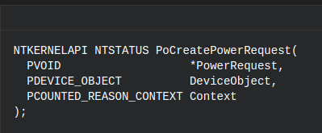

# Second milestone: Find Triggers

I took an arbitrary call stack of one of all gathered from the windbg script output and start trying to reverse the conditions in order to achieve the trigger of the event. I was writing this document (because was the first time I did this, I won't repeat this doc for every trigger (I guess)) [reversing etw register process](./internal_docs/reversing_etwpregisterProvider.odt). The thing was that while I started doing this, Aleks asked me to develop a framework in some native language # or Powershell, that could parse the information extracted from the scripts and make some nice outputs (still thinking what kind of outputs).

## Family of events

Once thing I realized while I was researching each trigger is that what we want is to try to cover as much providers and as much events as possible. Which means that if we are going to log the same event using two different call stacks, it won't be very useful. **I really should take this into account**

## First trigger (Just a dream... we use to had a MAJOR bug rememba?)

In order to start with this part, I arbitrary chosen one call stack from one analysis I made. The call stack is:

1. **nt!EtwWriteEx**
2. **nt!EtwWrite**
3. **nt!PopDiagTracePowerRequestChange**
4. **nt!PoSetPowerRequestInternal**
5. **nt!PopPowerRequestActionInfo**
6. **nt!NtPowerInformation**
7. **nt!KiSystemServiceCopyEnd**
8. **ntdll!NtPowerInformation**

So far I'm stuck with the way of getting the object from the handler. I want to see how the structure is build. I need it because some conditions depend on specific values of them. I've created a [doc](./internal_docs/reversing_power_information.odt) where I wrote down all the problems I've experienced.

### Creating PowerRequest

After a couple of days reversing stuff (as shown in the attacked doc) I started finding some useful relations. The first thing I understood was that this call-stack was directly related with a type of object called **PowerRequest**. Besides from the research I did and wrote in the doc, some days later I understood that this kind of object was related with the **Power Management** component of Windows. [Documentation](https://docs.microsoft.com/en-us/windows-hardware/drivers/kernel/windows-kernel-mode-power-manager)

My first idea was to try to create a **PowerRequest** object, manipulate it, get a **handler** to it, and give it to **ntdll!NtPowerInformation** with the rest of the parameters we already reversed. I found that, in order to create this kind of object, you should use the function **PoCreatePowerRequest** [docu](https://docs.microsoft.com/en-us/windows-hardware/drivers/ddi/content/ntifs/nf-ntifs-pocreatepowerrequest) which receives a pointer to a **deviceObject**. 



So, clearly, this kind of objects were totally related with devices. My following idea then, was to put a breakpoint in this function once I boot the system, hoping it won't be hitted too much times. Fortunately it was hitted only twice (in fact, three times, but the third was the same and the second). I wanted to understand more about this devices, that's why I print the structure of the devices ones the breakpoint was reached:


With help of some documentation ([DEVICE_OBJECT](https://msdn.microsoft.com/library/windows/hardware/ff543147),[DEVICE_TYPES](https://docs.microsoft.com/en-us/windows-hardware/drivers/kernel/specifying-device-types)) I finally understood that they were to drivers (in particular, paying attention to the type of device and the name of it).

So my idea was to: 

1. Get the device object.
2. Get a handler to it, and give it to the **PoCreatePowerRequest** in order to get a **PowerRequest** object.
3. Get a handler to it, and call the **ntdll!NtPowerInformation**.

Later, I realized also that **Device Objects** are generally contained inside **Driver Object**s and therefore, I should first find one of them.

### Re using PowerRequest

In some moment of this research, I thought that maybe, it wasn't necessary to create my own **PowerRequest** object, but use the same that the system was using when booting. But.. how to get the pointer to the **PowerRequest** of some of those?

My final idea was to do some manual testing. Due to one of the names of the drivers that created a **PowerRequest** object (according to the breakpoints) was **\Driver\HdAudAddService** I started thinking how to trigger this guy. Without too much effort, I finally discovered how. Make him do some task!

From manual testing, I got that voluming up and voluming down, seemed to trigger the breakpoint of the etwWrite related with DiagTrack. Therefore, I developed an .exe which will perform that task automatically. Unfortunately, when I executed the .exe,  no breakpoint was reached. But I knew I was close. In that moment, I thought that I should use my headset due to we were working with the audio driver. That was my best decision ever. Once I put on my headset I realized what was hitting the breakpoint: **playing sound**!!!.

My next move was to change the scripts, and instead of modifying the volume, I just played a system sound, hundred of times. The result were positive, analyzing the graphic made by the **DataVisualizator** we can see how each time we execute our trigger, how the amount of writes increase proportionally.

What means, that we have a PoC of our first trigger.

## Lets hunt triggers

After solving the major bug and using the new developed windbg scripts, I started again to search for real triggers. My strategy was very simple. I enabled the breakpoints in the same place and the windbg scripts, but I changed the whole script for just the following:

```
bp nt!EtwpEventWriteFull+0x371 ".if (r12d == @$t19){!process -1 0;r $t1 = poi(rbp+300h-280h);r $t2 = poi(rbp+300h-2C0h);dt nt!_EVENT_DESCRIPTOR @$t2;.printf \"PROVIDER_GUID: %N %N\n\", poi(@$t1+0x18), poi(@$t1+0x18+0x8);}.else{gc;}"
bp nt!EtwpWriteUserEvent+0x48d ".if (ebx == @$t19){!process -1 0;r $t1 = poi(rbp+360h-340h);r $t2 = poi(rbp+360h-330h)+0x28;;dt nt!_EVENT_DESCRIPTOR @$t2;.printf \"PROVIDER_GUID: %N %N\n\", poi(@$t1+0x18), poi(@$t1+0x18+0x8);}.else{gc;}"
```

With this statements, I was able to take control of the flow once a new event was being written. But, the main question is, how to trigger new events?.. Well, that part was just, walking through the system and start doing actions that may trigger something (changing configuration, pressing buttons, etc). Due to both breakpoints at the same time will be very overkill (I won't be able to do any action in the target system because it'll be very slow), I did one first and then the other. 

## Notepad Trigger

Going around the system, I realized that if you close a notepad/iexplorer/systemsettings or when starting a console as a Administrator, the breakpoint inside the function **EtwpEventWriteFull** will be reached. In all the aforementioned cases the id **0x8bd** and the provider **487D6E37-1B9D-46D3-A8FD-54CE8BDF8A53** where the ones logged.  Although, probably the real content of the event will be differnt among them, I don't finding very useful to log the same type of events from the same provider different times. That's why I decided to do only one trigger. I arbitrary choose to use the notepad one. 

I developed an .exe which, in summary, does the following steps:

1. Spawns a new process of notepad.
2. Executes a shell command killing all processes of notepad.

Due to some particular situations (if you kill the process using the guid instead of the name of the process, the trigger won't work) it's very important to mention that it should not be any notepad process running in the system, otherwise it will be closed as well.

### Different levels of telemetry

Can be infered from further information that each higher level includes the events of the previous ones. 

### Security 

**None** 

### Basic

* Providers: 487D6E37-1B9D-46D3-A8FD-54CE8BDF8A53
* Amount of Events: **1** (id: 0x8bd).
* Different events structure:
    * **Id:** 0x8bd, **Channel**: 0xb, **Level**: 0x5, **Keyword**: 0x00008000`00000800.
* Raw:
```
    kd>g
    PROCESS ffffdd868344c480
        SessionId: 1  Cid: 0774    Peb: ffffdd868344c480; !peb 821eee7000">821eee7000  ParentCid: 0e68">0e68
        DirBase: 53cc5000  ObjectTable: ffffc7004a4e8b00  HandleCount: <Data Not Accessible>
        Image: conhost.exe

    +0x000 Id               : 0x8bd
    +0x002 Version          : 0 ''
    +0x003 Channel          : 0xb ''
    +0x004 Level            : 0x5 ''
    +0x005 Opcode           : 0 ''
    +0x006 Task             : 0
    +0x008 Keyword          : 0x00008000`00000800
    PROVIDER_GUID: 46D31B9D487D6E37 538ADF8BCE54FDA8 nt!EtwpEventWriteFull+0x371:
    fffff802`6ceab361 488bc8          mov     rcx,rax

    kd> !wmitrace.logdump 0x22 -t 1
    [0]1310.0FF8::  131717129297892613 [Win32kTraceLogging/AppInteractivitySummary/]{"UTCReplace_AppId": "{00001310-0001-00f2-b321-c3fa07f4d301}", "UTCReplace_AppVersion": 1, "UTCReplace_CommandLineHash": 1, "AppSessionId": "{00001310-0001-00f2-b321-c3fa07f4d301}", "AggregationStartTime": "05/25/2018 09:07:59.274", "AggregationDurationMS": 14281, "InFocusDurationMS": 375, "FocusLostCount": 1, "NewProcessCount": 1, "UserActiveDurationMS": 375, "UserOrDisplayActiveDurationMS": 375, "UserActiveTransitionCount": 0, "InFocusBitmap.Length": 8, "InFocusBitmap": "00000008 c0 00 00 00 00 00 00 00", "InputSec": 0, "KeyboardInputSec": 0, "MouseInputSec": 0, "TouchInputSec": 0, "PenInputSec": 0, "HidInputSec": 0, "WindowWidth": 1025, "WindowHeight": 525, "MonitorWidth": 1920, "MonitorHeight": 1015, "MonitorFlags": "0x00", "WindowFlags": "0x10", "InteractiveTimeoutPeriodMS": 60000, "AggregationPeriodMS": 120000, "BitPeriodMS": 2000, "AggregationFlags": "0x00000031", "TotalUserOrDisplayActiveDurationMS": 375, "SummaryRound": 7, "SpeechRecognitionSec": 0, "GameInputSec": 0, "EventSequence": 106}
```

### Enhanced

**Equal to Basic**

### Full

* Providers: 487D6E37-1B9D-46D3-A8FD-54CE8BDF8A53 / 2839FF94-8F12-4E1B-82E3-AF7AF77A450F
* Amount of Events: **9**. 1 (id: 0x8bd), 5 (id: 0x3d95).
* Different events structure:
    * **Id:** 0x3d95, **Channel**: 0xb, **Level**: 0x5, **Keyword**: 0x3.
    * **Id:** 0x8bd, **Channel**: 0xb, **Level**: 0x5, **Keywor d**: 0x00008000`00000800.
* Raw:
```
kd> g
PROCESS ffffdd8683c6e780
    SessionId: 1  Cid: 1134    Peb: 3bb3382000  ParentCid: 091c
    DirBase: 09fe0000  ObjectTable: ffffc7004a1f49c0  HandleCount: <Data Not Accessible>
    Image: cmd.exe

   +0x000 Id               : 0x3d95
   +0x002 Version          : 0 ''
   +0x003 Channel          : 0xb ''
   +0x004 Level            : 0x5 ''
   +0x005 Opcode           : 0 ''
   +0x006 Task             : 0
   +0x008 Keyword          : 3
PROVIDER_GUID: 4E1B8F122839FF94 0F457AF77AAFE382 nt!EtwpEventWriteFull+0x371:
fffff802`6ceab361 488bc8          mov     rcx,rax
kd> g
PROCESS ffffdd8680f5f080
    SessionId: 1  Cid: 0440    Peb: 00777000  ParentCid: 1134
    DirBase: 1ad00000  ObjectTable: ffffc7004a908880  HandleCount: <Data Not Accessible>
    Image: TriggerNotepad.exe

   +0x000 Id               : 0x3d95
   +0x002 Version          : 0 ''
   +0x003 Channel          : 0xb ''
   +0x004 Level            : 0x5 ''
   +0x005 Opcode           : 0 ''
   +0x006 Task             : 0
   +0x008 Keyword          : 3
PROVIDER_GUID: 4E1B8F122839FF94 0F457AF77AAFE382 nt!EtwpEventWriteFull+0x371:
fffff802`6ceab361 488bc8          mov     rcx,rax
kd> g
PROCESS ffffdd8680f5f080
    SessionId: 1  Cid: 0440    Peb: 00777000  ParentCid: 1134
    DirBase: 1ad00000  ObjectTable: ffffc7004a908880  HandleCount: <Data Not Accessible>
    Image: TriggerNotepad.exe

   +0x000 Id               : 0x3d95
   +0x002 Version          : 0 ''
   +0x003 Channel          : 0xb ''
   +0x004 Level            : 0x5 ''
   +0x005 Opcode           : 0 ''
   +0x006 Task             : 0
   +0x008 Keyword          : 3
PROVIDER_GUID: 4E1B8F122839FF94 0F457AF77AAFE382 nt!EtwpEventWriteFull+0x371:
fffff802`6ceab361 488bc8          mov     rcx,rax
kd> g
PROCESS ffffdd8683bf9780
    SessionId: 1  Cid: 0e6c    Peb: 006bd000  ParentCid: 0440
    DirBase: 14531000  ObjectTable: ffffc70048771640  HandleCount: <Data Not Accessible>
    Image: cmd.exe

   +0x000 Id               : 0x3d95
   +0x002 Version          : 0 ''
   +0x003 Channel          : 0xb ''
   +0x004 Level            : 0x5 ''
   +0x005 Opcode           : 0 ''
   +0x006 Task             : 0
   +0x008 Keyword          : 3
PROVIDER_GUID: 4E1B8F122839FF94 0F457AF77AAFE382 nt!EtwpEventWriteFull+0x371:
fffff802`6ceab361 488bc8          mov     rcx,rax
kd> g
PROCESS ffffdd8683bf9780
    SessionId: 1  Cid: 0e6c    Peb: 006bd000  ParentCid: 0440
    DirBase: 14531000  ObjectTable: ffffc70048771640  HandleCount: <Data Not Accessible>
    Image: cmd.exe

   +0x000 Id               : 0x3d95
   +0x002 Version          : 0 ''
   +0x003 Channel          : 0xb ''
   +0x004 Level            : 0x5 ''
   +0x005 Opcode           : 0 ''
   +0x006 Task             : 0
   +0x008 Keyword          : 3
PROVIDER_GUID: 4E1B8F122839FF94 0F457AF77AAFE382 nt!EtwpEventWriteFull+0x371:
fffff802`6ceab361 488bc8          mov     rcx,rax
kd> g
PROCESS ffffdd8681c86080
    SessionId: 1  Cid: 12cc    Peb: 02c5e000  ParentCid: 0440
    DirBase: 12bf3000  ObjectTable: ffffc7004a43c7c0  HandleCount: <Data Not Accessible>
    Image: notepad.exe

   +0x000 Id               : 0x8bd
   +0x002 Version          : 0 ''
   +0x003 Channel          : 0xb ''
   +0x004 Level            : 0x5 ''
   +0x005 Opcode           : 0 ''
   +0x006 Task             : 0
   +0x008 Keyword          : 0x00008000`00000800
PROVIDER_GUID: 46D31B9D487D6E37 538ADF8BCE54FDA8 nt!EtwpEventWriteFull+0x371:
fffff802`6ceab361 488bc8          mov     rcx,rax
    > !wmitrace.logdump -0x22 -t 6
    [0]1134.0464::  131717118238067550 [KernelProcess/ProcessStarted/]{"InstanceStartTime": 131717118971747574, "InstanceId": 1796, "ParentPid": 4404, "SessionId": 1, "ImageFileName": "\Device\HarddiskVolume2\Users\Targeto\Desktop\TriggerNotepad.exe", "ProcessStartKey": 68116944363979058, "ProcessSequence": 306, "CreateInterruptTime": 9337040395, "SessionCreateTime": 95456695, "ImageChecksum": 0, "ImageTimeDateStamp": 1527075970, "PackageName": "", "PRAID": "", "UserSid": "S-1-5-21-3077531471-2210670182-2101899231-1001", "CommandLine": "TriggerNotepad.exe"}
    [0]0704.08F8::  131717118283193413 [KernelProcess/ProcessStarted/]{"InstanceStartTime": 131717119027599382, "InstanceId": 4304, "ParentPid": 1796, "SessionId": 1, "ImageFileName": "\Device\HarddiskVolume2\Windows\SysWOW64\notepad.exe", "ProcessStartKey": 68116944363979059, "ProcessSequence": 307, "CreateInterruptTime": 9338169163, "SessionCreateTime": 95456695, "ImageChecksum": 240409, "ImageTimeDateStamp": 1468633008, "PackageName": "", "PRAID": "", "UserSid": "S-1-5-21-3077531471-2210670182-2101899231-1001", "CommandLine": "\"C:\Windows\System32\notepad.exe\" "}
    [0]0704.0D7C::  131717118320225727 [KernelProcess/ProcessStarted/]{"InstanceStartTime": 131717119082520490, "InstanceId": 2396, "ParentPid": 1796, "SessionId": 1, "ImageFileName": "\Device\HarddiskVolume2\Windows\SysWOW64\cmd.exe", "ProcessStartKey": 68116944363979060, "ProcessSequence": 308, "CreateInterruptTime": 9339367047, "SessionCreateTime": 95456695, "ImageChecksum": 236440, "ImageTimeDateStamp": 1468633200, "PackageName": "", "PRAID": "", "UserSid": "S-1-5-21-3077531471-2210670182-2101899231-1001", "CommandLine": "\"C:\Windows\System32\cmd.exe\" /C taskkill /im notepad.exe"}
    [0]095C.0E70::  131717118364269867 [KernelProcess/ProcessStarted/]{"InstanceStartTime": 131717119126268800, "InstanceId": 4680, "ParentPid": 2396, "SessionId": 1, "ImageFileName": "\Device\HarddiskVolume2\Windows\System32\conhost.exe", "ProcessStartKey": 68116944363979061, "ProcessSequence": 309, "CreateInterruptTime": 9339542474, "SessionCreateTime": 95456695, "ImageChecksum": 79708, "ImageTimeDateStamp": 1468636093, "PackageName": "", "PRAID": "", "UserSid": "S-1-5-21-3077531471-2210670182-2101899231-1001", "CommandLine": "\??\C:\Windows\system32\conhost.exe 0xffffffff -ForceV1"}
    [0]095C.0E70::  131717118410429171 [KernelProcess/ProcessStarted/]{"InstanceStartTime": 131717119180763796, "InstanceId": 4904, "ParentPid": 2396, "SessionId": 1, "ImageFileName": "\Device\HarddiskVolume2\Windows\SysWOW64\taskkill.exe", "ProcessStartKey": 68116944363979062, "ProcessSequence": 310, "CreateInterruptTime": 9340533738, "SessionCreateTime": 95456695, "ImageChecksum": 114315, "ImageTimeDateStamp": 1468633447, "PackageName": "", "PRAID": "", "UserSid": "S-1-5-21-3077531471-2210670182-2101899231-1001", "CommandLine": "taskkill  /im notepad.exe"}
    [0]10D0.102C::  131717118452886173 [Win32kTraceLogging/AppInteractivitySummary/]{"UTCReplace_AppId": "{000010d0-0001-00f2-1658-7a9a05f4d301}", "UTCReplace_AppVersion": 1, "UTCReplace_CommandLineHash": 1, "AppSessionId": "{000010d0-0001-00f2-1658-7a9a05f4d301}", "AggregationStartTime": "05/25/2018 08:46:43.328", "AggregationDurationMS": 14500, "InFocusDurationMS": 266, "FocusLostCount": 1, "NewProcessCount": 1, "UserActiveDurationMS": 266, "UserOrDisplayActiveDurationMS": 266, "UserActiveTransitionCount": 0, "InFocusBitmap.Length": 8, "InFocusBitmap": "00000008 80 00 00 00 00 00 00 00", "InputSec": 0, "KeyboardInputSec": 0, "MouseInputSec": 0, "TouchInputSec": 0, "PenInputSec": 0, "HidInputSec": 0, "WindowWidth": 1025, "WindowHeight": 525, "MonitorWidth": 1920, "MonitorHeight": 1015, "MonitorFlags": "0x00", "WindowFlags": "0x10", "InteractiveTimeoutPeriodMS": 60000, "AggregationPeriodMS": 120000, "BitPeriodMS": 2000, "AggregationFlags": "0x00000031", "TotalUserOrDisplayActiveDurationMS": 266, "SummaryRound": 5, "SpeechRecognitionSec": 0, "GameInputSec": 0, "EventSequence": 82}


```

## SearchUI Trigger

Another trigger appeared while I try to open the Start Menu (windows bar). A **SearchUI.exe** was being called and this binary was logging a particular event. Also, each time (not sure if really EACH letter but I think so) you press a key in the search bar, a new event from **explorer.exe** will be logged. Due to I wanted to make as minimal as possible, I didn't want this logs. But, "unfortunately" at least one more log was needed (when you close the bar).

The first log had the id **0x4181** and was logged by the **E34441D9-5BCF-4958-B787-3BF824F362D7** provider, while the log related to the closing part of the bar was being logged with the id 
**0x5264** by the **3D6120A6-0986-51C4-213A-E2975903051D** provider.

I tried to implement this by doing a simulation of pressing the windows key, but I couldn't make it. Finally, I found some post that mentioned that the combination of keystrokes **CTRL** + **ESC** was also doing the same thing. Therefore, as a summary, I developed an .exe which performs the following actions:

1. Opens the start menu.
2. Waits for a little time so ensure that the bar is opened.
3. Closes the menu.

### Different levels of telemetry

### Security 

**None** 

### Basic

* Providers: E34441D9-5BCF-4958-B787-3BF824F362D7 / 3D6120A6-0986-51C4-213A-E2975903051D.
* Amount of Events: **2**. 1 (id: 0x4181), 1 (id: 0x5264 ).
* Different events structure:
    * **Id:** 0x4181, **Channel**: 0xb, **Level**: 0x5, **Keyword**: 0x00008000`00000800.
    * **Id:** 0x5264, **Channel**: 0xb, **Level**: 0x5, **Keyword**: 0x00008000`00000800.
* Raw:
```
    kd> g
    PROCESS ffffdd8683063780
        SessionId: 1  Cid: 0c24    Peb: ffffdd8683063780; !peb 38b0c71000">38b0c71000  ParentCid: 0278">0278
        DirBase: 5108d000  ObjectTable: ffffc70048a51c40  HandleCount: <Data Not Accessible>
        Image: SearchUI.exe

    +0x000 Id               : 0x4181
    +0x002 Version          : 0 ''
    +0x003 Channel          : 0xb ''
    +0x004 Level            : 0x5 ''
    +0x005 Opcode           : 0 ''
    +0x006 Task             : 0
    +0x008 Keyword          : 0x00008000`00000000
    PROVIDER_GUID: 49585BCFE34441D9 D762F324F83B87B7 nt!EtwpWriteUserEvent+0x48d:
    fffff802`6d21095d 418bd7          mov     edx,r15d
    kd> g
    PROCESS ffffdd868397f780
        SessionId: 1  Cid: 0a6c    Peb: ffffdd868397f780; !peb 93e6c50000">93e6c50000  ParentCid: 0278">0278
        DirBase: 1994d000  ObjectTable: ffffc70048a01880  HandleCount: <Data Not Accessible>
        Image: ShellExperienceHost.exe

    +0x000 Id               : 0x5264
    +0x002 Version          : 0 ''
    +0x003 Channel          : 0xb ''
    +0x004 Level            : 0x5 ''
    +0x005 Opcode           : 0 ''
    +0x006 Task             : 0
    +0x008 Keyword          : 0x00008000`00000000
    PROVIDER_GUID: 51C409863D6120A6 1D05035997E23A21 nt!EtwpWriteUserEvent+0x48d:
    fffff802`6d21095d 418bd7          mov     edx,r15d

    > !wmitrace.logdump 0x22 -t 2
    [0]0C24.0C48::  131717116244841193 [Microsoft.Windows.Shell.CortanaSearch/CortanaApp_UploadCommonSignals/]{"PartB_Asg.Content.AsgCortanaEvent": {"clientId": "F9E3AC2987A241DCAE20DAB93E9426CC", "impressionGuid": "A659FFB4A27A4585B93DFDA0A01AD5FB", "cortanaAppLifetimeGuid": "E869303B3341456AAAF04B717BE97BD9", "capabilities": 528, "appName": "SmartSearch", "eventType": "AppLifeCycle"}, "state": "UploadCommonSignals", "osSku": "125", "deviceMake": "", "deviceModel": "", "isDeviceTouch": 0, "deviceSku": "", "clientMarket": "en-DE", "entryPoint": "WNSSTB", "querySource": "StartButton", "secondaryQuerySource": "", "capabilities": 528, "accountType": "None"}
    [0]0A6C.0950::  131717117332835855 [Microsoft-Windows-Shell-Launcher/AllAppsSessionCompleted/]{"listLength": 16, "scrollActions": 0, "launchActions": 0, "launchActionsForItemsInAFolder": 0, "folderOpenedCount": 0, "folderClosedCount": 0, "folderContextMenuCount": 0, "contextMenuActions": 0, "dragActions": 0, "listHeaderClickedCount": 0, "backButtonActions": 0, "semanticZoomEnteredCount": 0, "semanticZoomExitedCount": 0, "dwellTime": 35969, "allAppsInvokeMethod": 3, "allAppsInputDeviceType": 0, "typeToJumpToLetterCount": 0}


```

### Enhanced

**Equal to Basic**.

### Full

**Equal to Enhanced**.

## One Drive trigger

In order to find some idea of events to try to trigger, I found this [page](https://docs.microsoft.com/en-us/windows/privacy/basic-level-windows-diagnostic-events-and-fields-1703). Due to our version is **1607** this is not exactly the same, but I guess that some of this events will be shared between both versions. 

Inside the **OneDrive** section of events, there was one realted with **"This event is related to registering or unregistering the OneDrive update task."**. I tried this into our version and it worked. 

Using the Task Scheduler (**schtasks.exe"**) I was able to first start the task (which is the core part, because is the one that triggers the real event) and afterards ending it.

**The problem with this trigger is that the event isn't being trigger inmediately after the task started to run. In the first tests I did it was like that, but afterwards I realise that isn't always like that. Which means that is kind of a problem. Anyways, we still need to work on this one because it is triggered also with the Security level of the Telemetry.**


### Different levels of telemetry

### Security 

* Providers: D34D654D-584A-4C59-B238-69A4B2817DBD.
* Amount of Events: **1** (id: 0xa7).
* Different events structure:
    * **Id:** 0xa7, **Channel**: 0xb, **Level**: 0x5, **Keyword**: 0x00008000`00000000.
* Raw:

```
kd> g
PROCESS ffff8002598ac080
    SessionId: 1  Cid: 1240    Peb: 0040d000  ParentCid: 0370
    DirBase: 4e24e000  ObjectTable: ffff9301e7f9d300  HandleCount: <Data Not Accessible>
    Image: OneDriveStandaloneUpdater.exe

   +0x000 Id               : 0xa7
   +0x002 Version          : 0 ''
   +0x003 Channel          : 0xb ''
   +0x004 Level            : 0x5 ''
   +0x005 Opcode           : 0 ''
   +0x006 Task             : 0
   +0x008 Keyword          : 0x00008000`00000000
PROVIDER_GUID: 4C59584AD34D654D BD7D81B2A46938B2 nt!EtwpWriteUserEvent+0x48d:
fffff801`b080295d 418bd7          mov     edx,r15d
```

### Basic

**Equal to Security**.

### Enhanced

**Equal to Basic**.

### Full

**Equal to Enhanced**.

## Action Center Trigger

### Security

**NONE**.

### Basic

* Providers: 4BFE0FDE-99D6-5630-8A47-DA7BFAEFD876
* Amount of Events: **1** (id: 0x30ea).
* Different events structure:
    * **Id:** 0x30ea, **Channel**: 0xb, **Level**: 0x5, **Keyword**: 0x00008000`00000000.
* Raw:

```
kd> g
PROCESS ffff900844cef780
    SessionId: 1  Cid: 0b40    Peb: 006fb000  ParentCid: 0b30
    DirBase: 55ade000  ObjectTable: ffffa784bd34adc0  HandleCount: <Data Not Accessible>
    Image: explorer.exe

START_EVENT_DESCRIPTOR
   +0x000 Id               : 0x30ea
   +0x002 Version          : 0 ''
   +0x003 Channel          : 0xb ''
   +0x004 Level            : 0x5 ''
   +0x005 Opcode           : 0 ''
   +0x006 Task             : 0
   +0x008 Keyword          : 0x00008000`00000000
PROVIDER_GUID: 563099D64BFE0FDE 76D8EFFA7BDA478A
Found Buffers: 4 Messages: 5, sorting entries
[0]0B40.0B70::  131726810498646183 [Microsoft-Windows-Shell-NotificationCenter/ActionCenterButtonStateOnLaunching/]{"messageState": 0, "notificationState": 1}
Total of 5 Messages from 4 Buffers
```

### Enhanced

**Same as Basic**.

### Full

**Same as Enhanced**.

## USB Trigger 

I just started playing a little bit with USB things. Disconnecting it, unmounting it, etc. I found that if you **Disable/Enable** it using the **DEVICE MANAGER**, 3/4 events (for each) will be triggered (at least, in the basic level. 
This basically means that we will have 6 events for this trigger (which I'm not sure if this is too much). 

The important thing here is that I wasn't able to found some way to perform it a programatic way. Still looking how to. I found this [powershell applet](https://gallery.technet.microsoft.com/Device-Management-7fad2388) but it didn't work for me, and also, in the web page, they say that it wasn't tested in W10. 

Finally got how to make it work. Powershell! 

The provider is not registered in the etw providers list gathered with the ps command. mmm Maybe it registers , writes and unregisters? 

If you execute it with the Executer,  a couple of times, the events won't appear each time is executed but just the first time. Maybe is something related either with a buffer filled of this events or with something related to the the process that is executing the script. Maybe if the same PID already executed it, then it won't log again the event? Not idea.. Should research a little more. 


### Security

**NONE**.

### Basic

* Providers: 836D9D37-46C1-41BE-A956-09B88F964468
* Amount of Events: **6/8**. 3/4 and 3/4 (id: 0x129, 0x1b4).
* Different events structure:
    * **Id:** 0x129, **Channel**: 0xb, **Level**: 0x5, **Keyword**: 0x00008000`00000000.
    * **Id:** 0x1b4, **Channel**: 0xb, **Level**: 0x5, **Keyword**: 0x00008000`00000000.
* Raw:

```
kd> g
PROVIDER_GUID: 41BE46C1836D9D37 6844968FB80956A9
PROCESS ffff900843c0b780
    SessionId: 0  Cid: 0168    Peb: 49c81cf000  ParentCid: 0214
    DirBase: 2e426000  ObjectTable: ffffa784bce8ff40  HandleCount: <Data Not Accessible>
    Image: svchost.exe

START_EVENT_DESCRIPTOR
   +0x000 Id               : 0x129
   +0x002 Version          : 0 ''
   +0x003 Channel          : 0xb ''
   +0x004 Level            : 0x5 ''
   +0x005 Opcode           : 0 ''
   +0x006 Task             : 0
   +0x008 Keyword          : 0x00008000`00000000
END_EVENT_DESCRIPTOR
(WmiTrace) LogDump for Logger Id 0x1f
Found Buffers: 4 Messages: 10, sorting entries
[0]0168.0720::  131727044074591555 [Microsoft.Windows.Inventory.Core/InventoryDevicePnpRemove/]{"PartB_Ms.Device.DeviceInventoryChange": {"action": 2, "objectType": "InventoryDevicePnp", "objectInstanceId": "usbstor\disk&ven_kingston&prod_datatraveler_3.0&rev_pmap\94de80724795b2102968db2d&0", "syncId": "{a45a5839-e923-4960-afbf-254797f808c8}", "inventoryId": "{FD56B3C4-8D56-01E9-3854-97BD25E21428}"}}
Total of 10 Messages from 4 Buffers

PROVIDER_GUID: 41BE46C1836D9D37 6844968FB80956A9
PROCESS ffff900843c0b780
    SessionId: 0  Cid: 0168    Peb: 49c81cf000  ParentCid: 0214
    DirBase: 2e426000  ObjectTable: ffffa784bce8ff40  HandleCount: <Data Not Accessible>
    Image: svchost.exe

START_EVENT_DESCRIPTOR
   +0x000 Id               : 0x129
   +0x002 Version          : 0 ''
   +0x003 Channel          : 0xb ''
   +0x004 Level            : 0x5 ''
   +0x005 Opcode           : 0 ''
   +0x006 Task             : 0
   +0x008 Keyword          : 0x00008000`00000000
(WmiTrace) LogDump for Logger Id 0x1f
Found Buffers: 4 Messages: 11, sorting entries
[0]0168.0720::  131727044148652017 [Microsoft.Windows.Inventory.Core/InventoryDevicePnpRemove/]{"PartB_Ms.Device.DeviceInventoryChange": {"action": 2, "objectType": "InventoryDevicePnp", "objectInstanceId": "swd\wpdbusenum\_??_usbstor#disk&ven_kingston&prod_datatraveler_3.0&rev_pmap#94de80724795b2102968db2d&0#{53f56307-b6bf-11d0-94f2-00a0c91efb8b}", "syncId": "{a45a5839-e923-4960-afbf-254797f808c8}", "inventoryId": "{FD56B3C4-8D56-01E9-3854-97BD25E21428}"}}
Total of 11 Messages from 4 Buffers

PROVIDER_GUID: 41BE46C1836D9D37 6844968FB80956A9
PROCESS ffff900843c0b780
    SessionId: 0  Cid: 0168    Peb: 49c81cf000  ParentCid: 0214
    DirBase: 2e426000  ObjectTable: ffffa784bce8ff40  HandleCount: <Data Not Accessible>
    Image: svchost.exe
START_EVENT_DESCRIPTOR
   +0x000 Id               : 0x129
   +0x002 Version          : 0 ''
   +0x003 Channel          : 0xb ''
   +0x004 Level            : 0x5 ''
   +0x005 Opcode           : 0 ''
   +0x006 Task             : 0
   +0x008 Keyword          : 0x00008000`00000000
(WmiTrace) LogDump for Logger Id 0x1f
Found Buffers: 4 Messages: 12, sorting entries
[0]0168.0720::  131727044210557881 [Microsoft.Windows.Inventory.Core/InventoryDevicePnpRemove/]{"PartB_Ms.Device.DeviceInventoryChange": {"action": 2, "objectType": "InventoryDevicePnp", "objectInstanceId": "storage\volume\_??_usbstor#disk&ven_kingston&prod_datatraveler_3.0&rev_pmap#94de80724795b2102968db2d&0#{53f56307-b6bf-11d0-94f2-00a0c91efb8b}", "syncId": "{a45a5839-e923-4960-afbf-254797f808c8}", "inventoryId": "{FD56B3C4-8D56-01E9-3854-97BD25E21428}"}}
Total of 12 Messages from 4 Buffers

PROVIDER_GUID: 41BE46C1836D9D37 6844968FB80956A9
PROCESS ffff900843c0b780
    SessionId: 0  Cid: 0168    Peb: ffff900843c0b780; !peb 49c81cf000">49c81cf000  ParentCid: 0214">0214
    DirBase: 2e426000  ObjectTable: ffffa784bce8ff40  HandleCount: <Data Not Accessible>
    Image: svchost.exe

START_EVENT_DESCRIPTOR
   +0x000 Id               : 0x1b4
   +0x002 Version          : 0 ''
   +0x003 Channel          : 0xb ''
   +0x004 Level            : 0x5 ''
   +0x005 Opcode           : 0 ''
   +0x006 Task             : 0
   +0x008 Keyword          : 0x00008000`00000000
END_EVENT_DESCRIPTOR
(WmiTrace) LogDump for Logger Id 0x1f
Found Buffers: 4 Messages: 10, sorting entries
[0]0168.0720::  131727044954084151 [Microsoft.Windows.Inventory.Core/InventoryDevicePnpAdd/]{"HWID.Count": 7, "HWID": [{"Value": "usbstor\diskkingstondatatraveler_3.0pmap", "Order": 0}, {"Value": "usbstor\diskkingstondatatraveler_3.0", "Order": 1}, {"Value": "usbstor\diskkingston", "Order": 2}, {"Value": "usbstor\kingstondatatraveler_3.0p", "Order": 3}, {"Value": "kingstondatatraveler_3.0p", "Order": 4}, {"Value": "usbstor\gendisk", "Order": 5}, {"Value": "gendisk", "Order": 6}], "COMPID.Count": 3, "COMPID": [{"Value": "usbstor\disk", "Order": 0}, {"Value": "usbstor\raw", "Order": 1}, {"Value": "gendisk", "Order": 2}], "ProblemCode": "0", "InstallState": "0", "Enumerator": "usbstor", "ContainerId": "{2f4f96e8-5a32-5652-a53a-5ec3c76a7200}", "DeviceState": "32", "ParentId": "usb\vid_0951&pid_1666\94de80724795b2102968db2d", "STACKID.Count": 3, "STACKID": [{"Value": "\driver\partmgr", "Order": 0}, {"Value": "\driver\disk", "Order": 1}, {"Value": "\driver\usbstor", "Order": 2}], "Description": "Kingston DataTraveler 3.0 USB Device", "MatchingID": "gendisk", "Class": "diskdrive", "ClassGuid": "{4d36e967-e325-11ce-bfc1-08002be10318}", "Manufacturer": "(Standard disk drives)", "Model": "Disk drive", "Inf": "disk.inf", "DriverVerVersion": "10.0.14393.0", "DriverVerDate": "06-21-2006", "Provider": "Microsoft", "DriverPackageStrongName": "disk.inf_amd64_879a35d65b2a8a7d", "DriverId": "0000fd1b0636a678b7ce257aec8282fd2fd8e95081cb", "Service": "disk", "LowerClassFilters": "", "LowerFilters": "", "UpperClassFilters": "", "UpperFilters": "", "PartB_Ms.Device.DeviceInventoryChange": {"action": 1, "objectType": "InventoryDevicePnp", "objectInstanceId": "usbstor\disk&ven_kingston&prod_datatraveler_3.0&rev_pmap\94de80724795b2102968db2d&0", "syncId": "{a45a5839-e923-4960-afbf-254797f808c8}", "inventoryId": "{FD56B3C4-8D56-01E9-3854-97BD25E21428}"}}
Total of 10 Messages from 4 Buffers

PROVIDER_GUID: 41BE46C1836D9D37 6844968FB80956A9
PROCESS ffff900843c0b780
    SessionId: 0  Cid: 0168    Peb: 49c81cf000  ParentCid: 0214
    DirBase: 2e426000  ObjectTable: ffffa784bce8ff40  HandleCount: <Data Not Accessible>
    Image: svchost.exe

START_EVENT_DESCRIPTOR
   +0x000 Id               : 0x1b4
   +0x002 Version          : 0 ''
   +0x003 Channel          : 0xb ''
   +0x004 Level            : 0x5 ''
   +0x005 Opcode           : 0 ''
   +0x006 Task             : 0
   +0x008 Keyword          : 0x00008000`00000000
END_EVENT_DESCRIPTOR
(WmiTrace) LogDump for Logger Id 0x1f
Found Buffers: 4 Messages: 11, sorting entries
[0]0168.0720::  131727045019366619 [Microsoft.Windows.Inventory.Core/InventoryDevicePnpAdd/]{"HWID.Count": 1, "HWID": [{"Value": "storage\volume", "Order": 0}], "COMPID.Count": 0, "COMPID": [], "ProblemCode": "0", "InstallState": "0", "Enumerator": "storage", "ContainerId": "{2f4f96e8-5a32-5652-a53a-5ec3c76a7200}", "DeviceState": "96", "ParentId": "root\volmgr\0000", "STACKID.Count": 4, "STACKID": [{"Value": "\driver\volsnap", "Order": 0}, {"Value": "\driver\volume", "Order": 1}, {"Value": "\driver\fvevol", "Order": 2}, {"Value": "\driver\volmgr", "Order": 3}], "Description": "Volume", "MatchingID": "storage\volume", "Class": "volume", "ClassGuid": "{71a27cdd-812a-11d0-bec7-08002be2092f}", "Manufacturer": "Microsoft", "Model": "Volume", "Inf": "volume.inf", "DriverVerVersion": "10.0.14393.0", "DriverVerDate": "06-21-2006", "Provider": "Microsoft", "DriverPackageStrongName": "volume.inf_amd64_6b18402fb32f0962", "DriverId": "0000627d7ab08b1865bceed6cad3551b36e0771678f0", "Service": "volume", "LowerClassFilters": "", "LowerFilters": "", "UpperClassFilters": "", "UpperFilters": "", "PartB_Ms.Device.DeviceInventoryChange": {"action": 1, "objectType": "InventoryDevicePnp", "objectInstanceId": "storage\volume\_??_usbstor#disk&ven_kingston&prod_datatraveler_3.0&rev_pmap#94de80724795b2102968db2d&0#{53f56307-b6bf-11d0-94f2-00a0c91efb8b}", "syncId": "{a45a5839-e923-4960-afbf-254797f808c8}", "inventoryId": "{FD56B3C4-8D56-01E9-3854-97BD25E21428}"}}
Total of 11 Messages from 4 Buffers

PROVIDER_GUID: 41BE46C1836D9D37 6844968FB80956A9
PROCESS ffff900843c0b780
    SessionId: 0  Cid: 0168    Peb: 49c81cf000  ParentCid: 0214
    DirBase: 2e426000  ObjectTable: ffffa784bce8ff40  HandleCount: <Data Not Accessible>
    Image: svchost.exe

END_PROCESS_INFO

START_EVENT_DESCRIPTOR
   +0x000 Id               : 0x1b4
   +0x002 Version          : 0 ''
   +0x003 Channel          : 0xb ''
   +0x004 Level            : 0x5 ''
   +0x005 Opcode           : 0 ''
   +0x006 Task             : 0
   +0x008 Keyword          : 0x00008000`00000000
END_EVENT_DESCRIPTOR
(WmiTrace) LogDump for Logger Id 0x1f
Found Buffers: 4 Messages: 12, sorting entries
[0]0168.0720::  131727045121537202 [Microsoft.Windows.Inventory.Core/InventoryDevicePnpAdd/]{"HWID.Count": 0, "HWID": [], "COMPID.Count": 2, "COMPID": [{"Value": "wpdbusenum\fs", "Order": 0}, {"Value": "swd\generic", "Order": 1}], "ProblemCode": "0", "InstallState": "0", "Enumerator": "swd", "ContainerId": "{2f4f96e8-5a32-5652-a53a-5ec3c76a7200}", "DeviceState": "32", "ParentId": "storage\volume\_??_usbstor#disk&ven_kingston&prod_datatraveler_3.0&rev_pmap#94de80724795b2102968db2d&0#{53f56307-b6bf-11d0-94f2-00a0c91efb8b}", "STACKID.Count": 3, "STACKID": [{"Value": "\driver\wpdupfltr", "Order": 0}, {"Value": "\driver\wudfrd", "Order": 1}, {"Value": "\driver\softwaredevice", "Order": 2}], "Description": "KINGSTON", "MatchingID": "wpdbusenum\fs", "Class": "wpd", "ClassGuid": "{eec5ad98-8080-425f-922a-dabf3de3f69a}", "Manufacturer": "Kingston", "Model": "DataTraveler 3.0", "Inf": "wpdfs.inf", "DriverVerVersion": "10.0.14393.0", "DriverVerDate": "06-21-2006", "Provider": "Microsoft", "DriverPackageStrongName": "wpdfs.inf_amd64_4b4cfcfa114bdc22", "DriverId": "0000d868717130c1ff830ea907558bb779a3bb21ce70", "Service": "wudfwpdfs", "LowerClassFilters": "", "LowerFilters": "", "UpperClassFilters": "", "UpperFilters": "", "PartB_Ms.Device.DeviceInventoryChange": {"action": 1, "objectType": "InventoryDevicePnp", "objectInstanceId": "swd\wpdbusenum\_??_usbstor#disk&ven_kingston&prod_datatraveler_3.0&rev_pmap#94de80724795b2102968db2d&0#{53f56307-b6bf-11d0-94f2-00a0c91efb8b}", "syncId": "{a45a5839-e923-4960-afbf-254797f808c8}", "inventoryId": "{FD56B3C4-8D56-01E9-3854-97BD25E21428}"}}
Total of 12 Messages from 4 Buffers

PROVIDER_GUID: 41BE46C1836D9D37 6844968FB80956A9
PROCESS ffff900843c0b780
    SessionId: 0  Cid: 0168    Peb: ffff900843c0b780; !peb 49c81cf000">49c81cf000  ParentCid: 0214">0214
    DirBase: 2e426000  ObjectTable: ffffa784bce8ff40  HandleCount: <Data Not Accessible>
    Image: svchost.exe

START_EVENT_DESCRIPTOR
   +0x000 Id               : 0x129
   +0x002 Version          : 0 ''
   +0x003 Channel          : 0xb ''
   +0x004 Level            : 0x5 ''
   +0x005 Opcode           : 0 ''
   +0x006 Task             : 0
   +0x008 Keyword          : 0x00008000`00000000

(WmiTrace) LogDump for Logger Id 0x1f
Found Buffers: 4 Messages: 10, sorting entries
[0]0168.0720::  131727046439461601 [Microsoft.Windows.Inventory.Core/InventoryDevicePnpRemove/]{"PartB_Ms.Device.DeviceInventoryChange": {"action": 2, "objectType": "InventoryDevicePnp", "objectInstanceId": "swd\ip_tunnel_vbus\isatap_1", "syncId": "{a45a5839-e923-4960-afbf-254797f808c8}", "inventoryId": "{FD56B3C4-8D56-01E9-3854-97BD25E21428}"}}
Total of 10 Messages from 4 Buffers

PROVIDER_GUID: 41BE46C1836D9D37 6844968FB80956A9
PROCESS ffff900843c0b780
    SessionId: 0  Cid: 0168    Peb: 49c81cf000  ParentCid: 0214
    DirBase: 2e426000  ObjectTable: ffffa784bce8ff40  HandleCount: <Data Not Accessible>
    Image: svchost.exe

START_EVENT_DESCRIPTOR
   +0x000 Id               : 0x1b4
   +0x002 Version          : 0 ''
   +0x003 Channel          : 0xb ''
   +0x004 Level            : 0x5 ''
   +0x005 Opcode           : 0 ''
   +0x006 Task             : 0
   +0x008 Keyword          : 0x00008000`00000000
END_EVENT_DESCRIPTOR
START_EVENT_JSON_FORMAT
(WmiTrace) LogDump for Logger Id 0x1f
Found Buffers: 4 Messages: 11, sorting entries
[0]0168.0720::  131727046533187128 [Microsoft.Windows.Inventory.Core/InventoryDevicePnpAdd/]{"HWID.Count": 1, "HWID": [{"Value": "*isatap", "Order": 0}], "COMPID.Count": 2, "COMPID": [{"Value": "swd\genericraw", "Order": 0}, {"Value": "swd\generic", "Order": 1}], "ProblemCode": "0", "InstallState": "0", "Enumerator": "swd", "ContainerId": "{00000000-0000-0000-ffff-ffffffffffff}", "DeviceState": "96", "ParentId": "swd\ip_tunnel_vbus\ip_tunnel_device_root", "STACKID.Count": 2, "STACKID": [{"Value": "\driver\tunnel", "Order": 0}, {"Value": "\driver\softwaredevice", "Order": 1}], "Description": "Microsoft ISATAP Adapter #2", "MatchingID": "*isatap", "Class": "net", "ClassGuid": "{4d36e972-e325-11ce-bfc1-08002be10318}", "Manufacturer": "Microsoft", "Model": "Microsoft ISATAP Adapter", "Inf": "nettun.inf", "DriverVerVersion": "10.0.14393.0", "DriverVerDate": "06-21-2006", "Provider": "Microsoft", "DriverPackageStrongName": "nettun.inf_amd64_e492882a4d9613a4", "DriverId": "0000022d77c53b516b7963aac0c3bbe4ca7b041f3c29", "Service": "tunnel", "LowerClassFilters": "", "LowerFilters": "", "UpperClassFilters": "", "UpperFilters": "", "PartB_Ms.Device.DeviceInventoryChange": {"action": 1, "objectType": "InventoryDevicePnp", "objectInstanceId": "swd\ip_tunnel_vbus\isatap_1", "syncId": "{a45a5839-e923-4960-afbf-254797f808c8}", "inventoryId": "{FD56B3C4-8D56-01E9-3854-97BD25E21428}"}}
Total of 11 Messages from 4 Buffers

```

### Enhanced

**Same as Basic**.

### Full

**Same as Enhanced**. Plus the process created ones. 0x3d95

## APP raiser

I saw a random event going on.. Catch it, look for its description and with the help of DA page of all events, I figure it out that it was related with **APPRAISER** (name of the event was **Microsoft.Windows.Appraiser.General.EnterpriseScenarioWithDiagTrackServiceRunning**). Figure it out how to execute this app by reading this [page](http://www.thewindowsclub.com/manually-run-windows-10-compatibility-appraiser).


When executing:
```
schtasks.exe /Run /TN "\Microsoft\Windows\Application Experience\Microsoft Compatibility Appraiser"
```
One by one in the cmd line, everything seems to working great. But if you use the executioner or even just a joined (with &&) command line, it won't triggered the number of events you specified but just one of them. I saw this behaviour also with the USB one  (which happens to be the same provider), but is not working like this with the notepad one.

### Security

**None** 

### Basic

* Providers: 
* Amount of Events: **1**. (id: 0x11).
* Different events structure:
    * **Id:** 0x11, **Channel**: 0xb, **Level**: 0x5, **Keyword**: 0x00008000`00000000.
* Raw:
```
PROVIDER_GUID: 836D9D37-46C1-41BE-A956-09B88F964468
PROCESS ffff8e0d8a26d780
    SessionId: 0  Cid: 12b4    Peb: 9668a92000  ParentCid: 0370
    DirBase: 5ef37000  ObjectTable: ffffc1882c236040  HandleCount: <Data Not Accessible>
    Image: CompatTelRunner.exe

   +0x000 Id               : 0x11
   +0x002 Version          : 0 ''
   +0x003 Channel          : 0xb ''
   +0x004 Level            : 0x5 ''
   +0x005 Opcode           : 0 ''
   +0x006 Task             : 0
   +0x008 Keyword          : 0x00008000`00000000
END_EVENT_DESCRIPTOR
START_EVENT_JSON_FORMAT
(WmiTrace) LogDump for Logger Id 0x21
Found Buffers: 4 Messages: 13, sorting entries
[0]12B4.0EF0::  131728540702742434 [Microsoft.Windows.Inventory.Core/AmiTelCacheHealth/]{"__TlgCV__": "Gyh2tGGRZEavOM94.6.0", "ProviderItemCounts": "Device:0;DeviceCensus:16;File:2;Generic:0;HwItem:0;InventoryApplication:23;InventoryApplicationFile:19;InventoryDeviceContainer:13;InventoryDeviceMediaClass:1;InventoryDevicePnp:52;InventoryDriverBinary:309;InventoryDriverPackage:2;Metadata:0;Orphan:59;Programs:7;"}
Total of 13 Messages from 4 Buffers
```

### Enhanced

**Same as Basic**

### Full

**Same as Enhanced** (plus process event started)

## CENSUS

Reading the page I found out that there is a service call **Census** which gathers lot of information related with different sources (hardware, networking, os, etc). 

I found that this app can be triggered by executing its .exe which is located at **C:\\Windows\\system32\\** and is called **DeviceCensus.exe**. 
Interesting thing is that, if you executed only once, probably it will show just one event (id: 0x1fe), kind of event informing that it was executed. But if you execute it 5 times, the last one will not only print the 0x1fe event, but also a lot of different of them showing several information different sources. Here is a [proof](./internal_docs/proof_5_times_census.html) of it. 

**STILL NEED TO DEVELOP THIS TRIGGER, I JUST TESTED MANUALLY BY COMMAND LINE**

### Security

**None** 

### Basic

* Providers: 
* Amount of Events: **1**. (id: 0x1fe).
* Different events structure:
    * **Id:** 0x1fe, **Channel**: 0xb, **Level**: 0x5, **Keyword**: 0x00008000`00000000.
* Raw:
```
PROVIDER_GUID: 46CF5C84262CDE7A 69EF913796942094

PROCESS ffff8e0d8a6e9080
    SessionId: 1  Cid: 0f58    Peb: f0276b9000  ParentCid: 04e4
    DirBase: 67a88000  ObjectTable: ffffc1882c3fa580  HandleCount: <Data Not Accessible>
    Image: DeviceCensus.exe

START_EVENT_DESCRIPTOR
   +0x000 Id               : 0x1fe
   +0x002 Version          : 0 ''
   +0x003 Channel          : 0xb ''
   +0x004 Level            : 0x5 ''
   +0x005 Opcode           : 0 ''
   +0x006 Task             : 0
   +0x008 Keyword          : 0x00008000`00000000
END_EVENT_DESCRIPTOR
START_EVENT_JSON_FORMAT
(WmiTrace) LogDump for Logger Id 0x21
Found Buffers: 4 Messages: 18, sorting entries
[0]0F58.133C::  131728645762917499 [Census/App/]{"__TlgCV__": "X0BX596o1kyBj176.0", "IEVersion": "11.0.14393.0", "CensusVersion": 100143930000}
Total of 18 Messages from 4 Buffers
```
### Enhanced

**Same as Basic**

### Full

**Same as Enhanced** (plus process event started)

## Triggers resume

| Title             |Amount of Events       | Affected Function |                         Provider(s)                                        |   Event id(s) | Spont| Reliability|Comments/Notes|
|:-----------------:|:---------------------:|:-----------------:|:--------------------------------------------------------------------------:|:-------------:|:----:|:----------:|-----------------:
|Notepad            |0(S),1(B),1(E),6(F)    |EtwpEventWriteFull | 487D6E37-1B9D-46D3-A8FD-54CE8BDF8A53 / 2839FF94-8F12-4E1B-82E3-AF7AF77A450F|0x08bd / 0x3d95| No   | Perfect    |
|SearchUI           |0(S),2(B),2(E),2(F)    |EtwpWriteUserEvent | E34441D9-5BCF-4958-B787-3BF824F362D7 / 3D6120A6-0986-51C4-213A-E2975903051D|0x4181 / 0x5264| No   | Perfect    |
|USB ena/disabling  |0(S),6(B),6(E),8(F)    |EtwpWriteUserEvent | 836D9D37-46C1-41BE-A956-09B88F964468                                       |0x129 / 0x1b4  | No   | Perfect    | Requires some USB in the machine & admin. (some issues wheen executing much more than one very close to the other)
|AppRaiser          |0(S),1(B),1(E),1(F)    |EtwpWriteUserEvent | 836D9D37-46C1-41BE-A956-09B88F964468                                       |0x11           | No   | Perfect    | Requires admin privileges. (some issues wheen executing much more than one very close to the other)
|Census             |0(S),1(B),1(E),1(F)    |EtwpWriteUserEvent | 262CDE7A-5C84-46CF-9420-94963791EF69                                       |0x1fe           | No   | Perfect    | Requires admin privileges. (some issues wheen executing much more than one very close to the other)
|Action Center      |0(S),1(B),1(E),1(F)    |EtwpWriteUserEvent | 4BFE0FDE-99D6-5630-8A47-DA7BFAEFD876                                       |0x30ea         | No   | Good       |
|OneDrive           |**1(S)**,1(B),1(E),1(F)|EtwpWriteUserEvent | D34D654D-584A-4C59-B238-69A4B2817DBD                                       |0xa7           | No   | BAD        |

## Issues

Something strange happens after a couple of times that the events are triggered manually (even after reboot). Is like there is a kind of buffer for each specific event, of kind like that, because each time that I execute a couple of times some of the triggers, it stop working. It happened first with Onedrive, then with ActionCenter and finally with USB. USB not only the trigger is not working but also the manual way (that was going to the device manager and disabling / enabling the usb). 

But after I used the script couple of times suddenly, the events are not logged any more.. WHYYYY? 

IDEA: Trigger to get the provider regsitered also?  After I turn on the usb of the VM it started to work (CHECK!)


## Possible triggers

* copying and pastying data? 
* svchost with the sc create command
* using the Search app on the windwos bar.
* Modifying some reg key? 
* More realted with scheduled tasks